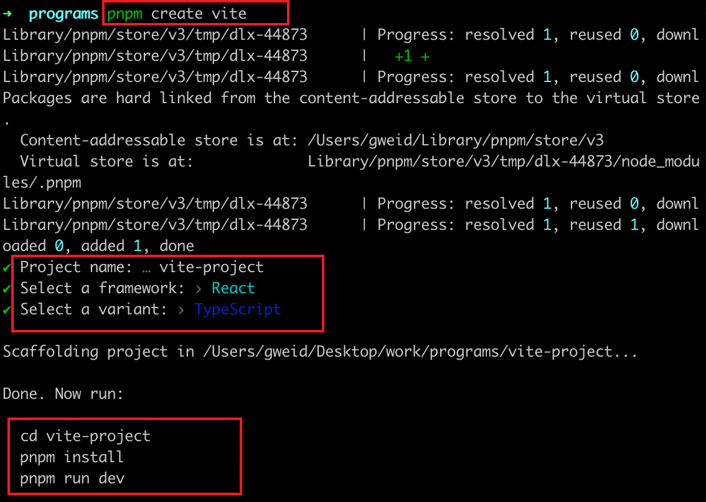
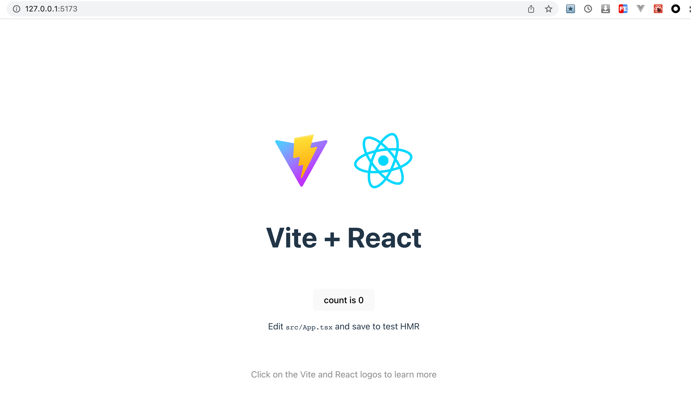
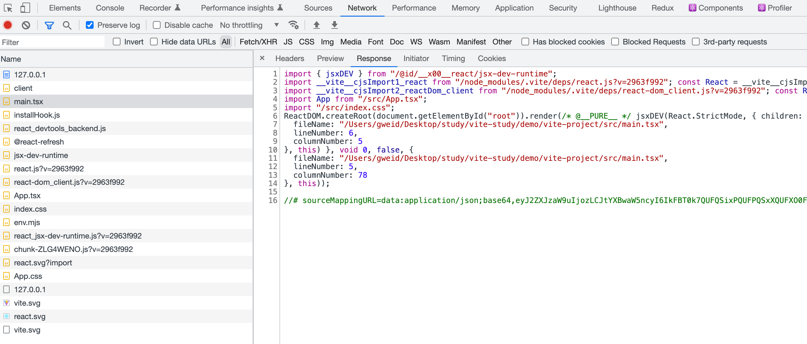
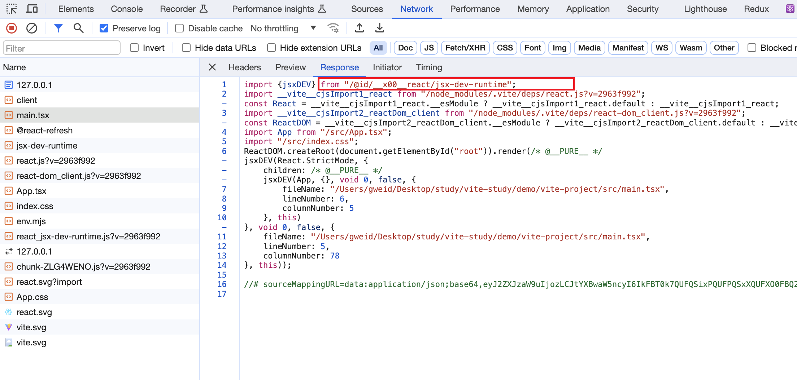
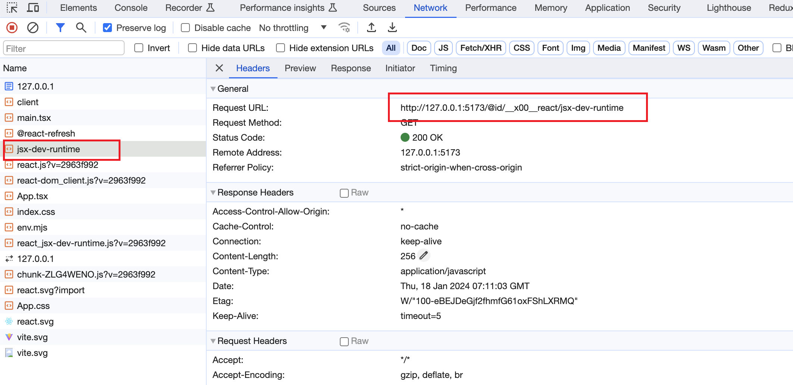

# Vite

vite 学习总结


## 前言

前端工程的痛点：

- **前端的模块化需求**：前端的模块标准非常多，包括 ESM、CommonJS、AMD 和 CMD 等等。前端工程一方面需要落实这些模块规范，保证模块正常加载。另一方面需要兼容不同的模块规范，以适应不同的执行环境
- **浏览器兼容、转译高级语法**：由于浏览器实现规范的限制，还有不同浏览器版本语法兼容不同等原因，高级语法（ts、jsx、新es语法）等需要在浏览器运行，就得转译成浏览器可识别的形式。这个需要在工程编译层面支持
- **线上代码质量**：与开发环境不同，在生产环境中，不仅需要考虑代码的兼容性、安全性，还需要考虑代码运行时的性能问题等
- **开发效率问题**：项目的冷启动/二次启动、热更新时间，都会影响开发效率，尤其是项目越来越大的时候


而目前社区已有的，例如：webpack、rollup、parcel 等，都能解决上面的问题：

- 模块化方面，提供模块加载方案，并兼容不同的模块规范
- 语法转译方面，配合 `Sass`、`Babel` 等前端工具链，对高级语法进行转译，同时对于静态资源也能进行处理，使之能作为一个模块正常加载
- 产物质量方面，在生产环境中，配合 `Terser`等压缩工具进行代码压缩和混淆，通过 `Tree Shaking` 删除未使用的代码，提供对于低版本浏览器的语法降级处理等
- 开发效率方面，使用缓存、多线程等方式


而 Vite 的优势：兼具了以上的能力，并且做到更**高效**

- 一方面，vite 在开发阶段基于浏览器原生 ESM 的支持实现了`no-bundle`服务，
- 另一方面，构建阶段，借助 Esbuild 超快的编译速度来做第三方库构建和 TS/JSX 语法编译

基于以上两点，vite 能将项目的启动性能提升一个量级，并且达到毫秒级的瞬间热更新效果


其它方面的能力：

- 模块化方面，vite 基于浏览器原生的 ESM 支持实现模块加载，并且无论是在开发还是生产环境，都可以将其它格式的产物(如 CommonJS)转换为 ESM
- 语法转译方面，vite 内置了对 ts、jsx 等高级语法的支持，也能加载各种静态资源，例如图片等
- 产物质量方面，vite 基于 rollup 实现生产环境打包，同时可以配合`Terser`、`Babel`等工具链，可以极大程度保证构建产物的质量


## vite 的基本使用


### 项目初始化


通过命令行，快速创建 vite 项目，这里使用 pnpm 进行方式管理包

执行以下命令：

```js
pnpm create vite
```

执行完这个命令，pnpm 会先下载 `create-vite` 这个包，然后执行这个包的项目初始化逻辑，如下：



基本步骤就是：

1. 输入项目名称
2. 选择框架（react、vue 等）
3. 选择开发语言（js、ts 等）


创建完毕，进入项目，安装依赖，执行 `pnpm run dev` 即可启动项目，即可通过 `http://localhost:5173/` 进行访问：




### 项目入口加载

vite 项目的基本结构如下：

```
.
├── public
│   └── vite.svg
├── src
│   ├── assets
│   └──── react.svg
│   ├── App.css
│   ├── App.tsx
│   ├── index.css
│   ├── main.tsx
│   └── vite-env.d.ts
├── index.html
├── package.json
├── pnpm-lock.yaml
├── tsconfig.json
├── tsconfig.node.json
└── vite.config.ts
```


在项目根目录下，有 `index.html` 文件，这就是 vite 项目默认的入口文件，也就是访问 `http://localhost:5173/` 的时候，vite 的 Dev Server 会自动返回这个 HTML 文件的内容


下面来看下这个 `index.html` 里面的内容：

```html
<!DOCTYPE html>
<html lang="en">
  <head>
    <meta charset="UTF-8" />
    <link rel="icon" type="image/svg+xml" href="/vite.svg" />
    <meta name="viewport" content="width=device-width, initial-scale=1.0" />
    <title>Vite + React + TS</title>
  </head>
  <body>
    <div id="root"></div>
    <script type="module" src="/src/main.tsx"></script>
  </body>
</html>
```


这里面，比较重要的就是 

```js
<script type="module" src="/src/main.tsx"></script>
```

利用了现代浏览器原生支持 ES 模块规范的特性，只需要在 script 标签中声明 `type="module"` 即可。这样，相当于请求了 `http://localhost:5173/src/main.tsx` 这个资源，vite 的 Dev Server 此时会接受到这个请求，然后读取对应的文件内容，对内容进行一些列的处理，最后返回给浏览器


接下来，看下 `src/main.tsx` 的内容

```tsx
import React from 'react'
import ReactDOM from 'react-dom/client'
import App from './App'
import './index.css'

ReactDOM.createRoot(document.getElementById('root') as HTMLElement).render(
  <React.StrictMode>
    <App />
  </React.StrictMode>,
)
```

这里有几个疑问：

- 浏览器并不会识别 tsx 语法
- 浏览器也已无法直接 import css 文件

浏览器执行这段代码归功于 vite 做了一系列的处理。首先，在读取到 `main.tsx`文件的内容之后，vite 会对文件的内容进行编译，查看浏览器，可以看到返回如下代码：



Vite 会将项目的源代码编译成浏览器可以识别的代码，与此同时，一个 import 语句即代表了一个 HTTP 请求，基于请求，Vite Dev Server 会读取本地文件，返回浏览器可以解析的代码。当浏览器解析到新的 import 语句，又会发出新的请求，以此类推，直到所有的资源都加载完成







基于上述，vite 的 `no-bundle` 理念就是： **利用浏览器原生 ES 模块的支持，实现开发阶段的 Dev Server，进行模块的按需加载**，而不是**先整体打包再进行加载**。相比 Webpack 这种必须打包再加载的传统构建模式，vite 在**开发阶段省略了繁琐且耗时的打包过程**，这也是 vite 为什么快的一个重要原因。


### vite 构建

看下 vite 相关的构建命令

> package.json

```js
"scripts": {
  // 开发环境启动项目
  "dev": "vite",
  // 打生产环境包
  "build": "tsc && vite build",
  // 生产环境打包完，预览产物
  "preview": "vite preview"
}
```


这里有一个问题，就是，在执行生产环境打包的时候，为什么要先执行 `tsc` ？

`tsc` 作为 TypeScript 的官方编译命令，可以用来编译 TypeScript 代码并进行类型检查，而这里的作用主要是用来做类型检查。这可以从 `tsconfig.json` 中确定，有如下配置：

```json
{
  "compilerOptions": {
    // 1. noEmit 表示只做类型检查，而不会输出产物文件
    // 2. 与 tsc --noEmit 命令等效
    "noEmit": true
  }
}
```

虽然 vite 提供了开箱即用的 TypeScript 以及 JSX 的编译能力，但实际上底层并没有实现 TypeScript 的类型校验系统，因此需要借助 `tsc` 来完成类型校验，在打包前提早暴露出类型相关的问题，保证代码的健壮性

主要原因：

> 之所以不把类型检查作为转换过程的一部分，是因为这两项工作在本质上是不同的。转译可以在每个文件的基础上进行，与 Vite 的按需编译模式完全吻合。相比之下，类型检查需要了解整个模块图。把类型检查塞进 Vite 的转换管道，将不可避免地损害 Vite 的速度优势。
>
> Vite 的工作是尽可能快地将源模块转化为可以在浏览器中运行的形式。为此，我们建议将静态分析检查与 Vite 的转换管道分开。这一原则也适用于其他静态分析检查，例如 ESLint。
>
> - 在构建生产版本时，你可以在 Vite 的构建命令之外运行 `tsc --noEmit`。
> - 在开发时，如果你需要更多的 IDE 提示，我们建议在一个单独的进程中运行 `tsc --noEmit --watch`，或者如果你喜欢在浏览器中直接看到上报的类型错误，可以使用 [vite-plugin-checker](https://github.com/fi3ework/vite-plugin-checker)。


执行完 `pnpm build` 构建后，得到构建产物，此时可以通过 `pnpm preview` 预览一下**打包产物**的执行效果，相当于在本地起了服务，去加载 build 之后的资源

> 注意：使用 pnpm preview 之前，要先 build 构建出产物


### vite 对样式资源的处理

 


