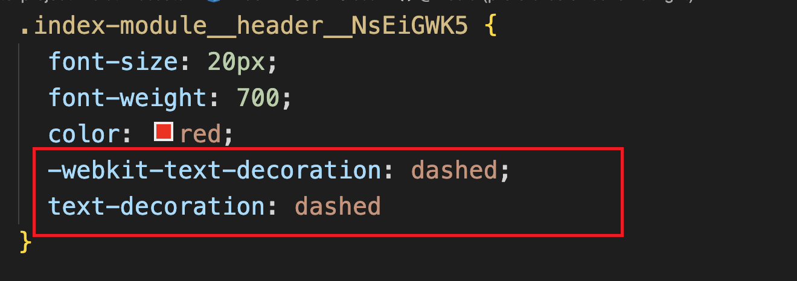
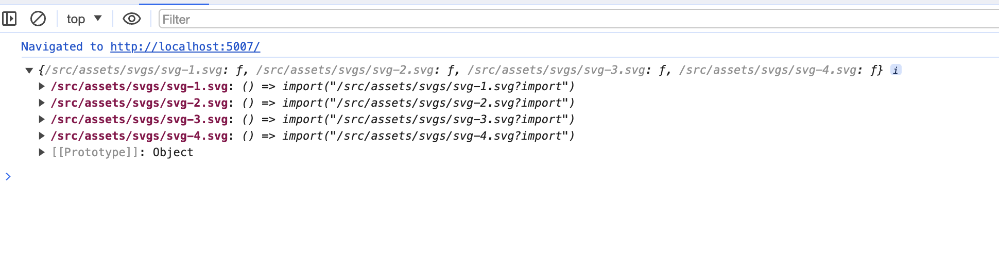

# Vite

vite 学习总结


[vite插件推荐](https://juejin.cn/post/7287131053566459963)


## 前言

前端工程的痛点：

- **前端的模块化需求**：前端的模块标准非常多，包括 ESM、CommonJS、AMD 和 CMD 等等。前端工程一方面需要落实这些模块规范，保证模块正常加载。另一方面需要兼容不同的模块规范，以适应不同的执行环境
- **浏览器兼容、转译高级语法**：由于浏览器实现规范的限制，还有不同浏览器版本语法兼容不同等原因，高级语法（ts、jsx、新es语法）等需要在浏览器运行，就得转译成浏览器可识别的形式。这个需要在工程编译层面支持
- **线上代码质量**：与开发环境不同，在生产环境中，不仅需要考虑代码的兼容性、安全性，还需要考虑代码运行时的性能问题等
- **开发效率问题**：项目的冷启动/二次启动、热更新时间，都会影响开发效率，尤其是项目越来越大的时候


而目前社区已有的，例如：webpack、rollup、parcel 等，都能解决上面的问题：

- 模块化方面，提供模块加载方案，并兼容不同的模块规范
- 语法转译方面，配合 `Sass`、`Babel` 等前端工具链，对高级语法进行转译，同时对于静态资源也能进行处理，使之能作为一个模块正常加载
- 产物质量方面，在生产环境中，配合 `Terser`等压缩工具进行代码压缩和混淆，通过 `Tree Shaking` 删除未使用的代码，提供对于低版本浏览器的语法降级处理等
- 开发效率方面，使用缓存、多线程等方式


而 Vite 的优势：兼具了以上的能力，并且做到更**高效**

- 一方面，vite 在开发阶段基于浏览器原生 ESM 的支持实现了`no-bundle`服务，
- 另一方面，构建阶段，借助 Esbuild 超快的编译速度来做第三方库构建和 TS/JSX 语法编译

基于以上两点，vite 能将项目的启动性能提升一个量级，并且达到毫秒级的瞬间热更新效果


其它方面的能力：

- 模块化方面，vite 基于浏览器原生的 ESM 支持实现模块加载，并且无论是在开发还是生产环境，都可以将其它格式的产物(如 CommonJS)转换为 ESM
- 语法转译方面，vite 内置了对 ts、jsx 等高级语法的支持，也能加载各种静态资源，例如图片等
- 产物质量方面，vite 基于 rollup 实现生产环境打包，同时可以配合`Terser`、`Babel`等工具链，可以极大程度保证构建产物的质量


## vite 的基本使用


### 项目初始化


通过命令行，快速创建 vite 项目，这里使用 pnpm 进行方式管理包

执行以下命令：

```js
pnpm create vite
```

执行完这个命令，pnpm 会先下载 `create-vite` 这个包，然后执行这个包的项目初始化逻辑，如下：


基本步骤就是：

1. 输入项目名称
2. 选择框架（react、vue 等）
3. 选择开发语言（js、ts 等）


创建完毕，进入项目，安装依赖，执行 `pnpm run dev` 即可启动项目，即可通过 `http://localhost:5173/` 进行访问：


### 项目入口加载

vite 项目的基本结构如下：

```
.
├── public
│   └── vite.svg
├── src
│   ├── assets
│   └──── react.svg
│   ├── App.css
│   ├── App.tsx
│   ├── index.css
│   ├── main.tsx
│   └── vite-env.d.ts
├── index.html
├── package.json
├── pnpm-lock.yaml
├── tsconfig.json
├── tsconfig.node.json
└── vite.config.ts
```


在项目根目录下，有 `index.html` 文件，这就是 vite 项目默认的入口文件，也就是访问 `http://localhost:5173/` 的时候，vite 的 Dev Server 会自动返回这个 HTML 文件的内容


下面来看下这个 `index.html` 里面的内容：

```html
<!DOCTYPE html>
<html lang="en">
  <head>
    <meta charset="UTF-8" />
    <link rel="icon" type="image/svg+xml" href="/vite.svg" />
    <meta name="viewport" content="width=device-width, initial-scale=1.0" />
    <title>Vite + React + TS</title>
  </head>
  <body>
    <div id="root"></div>
    <script type="module" src="/src/main.tsx"></script>
  </body>
</html>
```


这里面，比较重要的就是 

```js
<script type="module" src="/src/main.tsx"></script>
```

利用了现代浏览器原生支持 ES 模块规范的特性，只需要在 script 标签中声明 `type="module"` 即可。这样，相当于请求了 `http://localhost:5173/src/main.tsx` 这个资源，vite 的 Dev Server 此时会接受到这个请求，然后读取对应的文件内容，对内容进行一些列的处理，最后返回给浏览器


接下来，看下 `src/main.tsx` 的内容

```tsx
import React from 'react'
import ReactDOM from 'react-dom/client'
import App from './App'
import './index.css'

ReactDOM.createRoot(document.getElementById('root') as HTMLElement).render(
  <React.StrictMode>
    <App />
  </React.StrictMode>,
)
```

这里有几个疑问：

- 浏览器并不会识别 tsx 语法
- 浏览器也已无法直接 import css 文件

浏览器执行这段代码归功于 vite 做了一系列的处理。首先，在读取到 `main.tsx`文件的内容之后，vite 会对文件的内容进行编译，查看浏览器，可以看到返回如下代码：


Vite 会将项目的源代码编译成浏览器可以识别的代码，与此同时，一个 import 语句即代表了一个 HTTP 请求，基于请求，Vite Dev Server 会读取本地文件，返回浏览器可以解析的代码。当浏览器解析到新的 import 语句，又会发出新的请求，以此类推，直到所有的资源都加载完成


基于上述，vite 的 `no-bundle` 理念就是： **利用浏览器原生 ES 模块的支持，实现开发阶段的 Dev Server，进行模块的按需加载**，而不是**先整体打包再进行加载**。相比 Webpack 这种必须打包再加载的传统构建模式，vite 在**开发阶段省略了繁琐且耗时的打包过程**，这也是 vite 为什么快的一个重要原因。


### vite 构建

看下 vite 相关的构建命令

> package.json

```js
"scripts": {
  // 开发环境启动项目
  "dev": "vite",
  // 打生产环境包
  "build": "tsc && vite build",
  // 生产环境打包完，预览产物
  "preview": "vite preview"
}
```


这里有一个问题，就是，在执行生产环境打包的时候，为什么要先执行 `tsc` ？

`tsc` 作为 TypeScript 的官方编译命令，可以用来编译 TypeScript 代码并进行类型检查，而这里的作用主要是用来做类型检查。这可以从 `tsconfig.json` 中确定，有如下配置：

```json
{
  "compilerOptions": {
    // 1. noEmit 表示只做类型检查，而不会输出产物文件
    // 2. 与 tsc --noEmit 命令等效
    "noEmit": true
  }
}
```

虽然 vite 提供了开箱即用的 TypeScript 以及 JSX 的编译能力，但实际上底层并没有实现 TypeScript 的类型校验系统，因此需要借助 `tsc` 来完成类型校验，在打包前提早暴露出类型相关的问题，保证代码的健壮性

主要原因：

> 之所以不把类型检查作为转换过程的一部分，是因为这两项工作在本质上是不同的。转译可以在每个文件的基础上进行，与 Vite 的按需编译模式完全吻合。相比之下，类型检查需要了解整个模块图。把类型检查塞进 Vite 的转换管道，将不可避免地损害 Vite 的速度优势。
>
> Vite 的工作是尽可能快地将源模块转化为可以在浏览器中运行的形式。为此，我们建议将静态分析检查与 Vite 的转换管道分开。这一原则也适用于其他静态分析检查，例如 ESLint。
>
> - 在构建生产版本时，你可以在 Vite 的构建命令之外运行 `tsc --noEmit`。
> - 在开发时，如果你需要更多的 IDE 提示，我们建议在一个单独的进程中运行 `tsc --noEmit --watch`，或者如果你喜欢在浏览器中直接看到上报的类型错误，可以使用 [vite-plugin-checker](https://github.com/fi3ework/vite-plugin-checker)。


执行完 `pnpm build` 构建后，得到构建产物，此时可以通过 `pnpm preview` 预览一下**打包产物**的执行效果，相当于在本地起了服务，去加载 build 之后的资源

> 注意：使用 pnpm preview 之前，要先 build 构建出产物


### vite 对样式资源的处理

样式方案是前端工程化绕不开的一个话题，在最原始的开发阶段大家都是手写原生的 CSS，但原生 CSS 存在着诸多问题：

- **发体验**欠佳。比如原生 CSS 不支持选择器的嵌套（从Chrome 112 开始，原生 CSS也支持嵌套了）
- **样式污染**问题。如果出现同样的类名，很容易造成不同的样式互相覆盖和污染
- **浏览器兼容**问题。为了兼容不同的浏览器，我们需要对一些属性(如`transition`)加上不同的浏览器前缀
- 打包后的**代码体积**问题。如果不用任何的 CSS 工程化方案，所有的 CSS 代码都将打包到产物中，即使有部分样式并没有在代码中使用，导致产物体积过大


针对上述问题，社区诞生了一些方案：

- `CSS 预处理器`：主流的包括`Sass/Scss`、`Less`和`Stylus`。这些方案各自定义了一套语法，让 CSS 也能使用嵌套规则，甚至能像编程语言一样定义变量、写条件判断和循环语句，增强了样式语言的灵活性，解决原生 CSS 的**开发体验问题**
- `CSS Modules`：能将 CSS 类名处理成哈希值，这样就可以避免同名的情况下**样式污染**的问题
- CSS 后处理器`PostCSS`，用来解析和处理 CSS 代码，可以实现的功能非常丰富，比如将 `px` 转换为 `rem`、根据目标浏览器情况自动加上类似于`--moz--`、`-o-`的属性前缀等等
- `CSS in JS` 方案，主流的包括`emotion`、`styled-components`等等，顾名思义，这类方案可以实现直接在 JS 中写样式代码，基本包含`CSS 预处理器`和 `CSS Modules` 的各项优点，非常灵活，解决了开发体验和全局样式污染的问题
- CSS 原子化框架，如`Tailwind CSS`、`Windi CSS`，通过类名来指定样式，大大简化了样式写法，提高了样式开发的效率，主要解决了原生 CSS **开发体验**的问题

这几种方案没有孰优孰劣，各自解决的方案有重叠的部分，但也有一定的差异

那么，在 vite 中要怎么使用这几种方案呢？


#### CSS 预处理器

Vite 本身对 CSS 各种预处理器语言(`Sass/Scss`、`Less`和`Stylus`)做了内置支持。也就是说，即使你不经过任何的配置也可以直接使用各种 CSS 预处理器。

由于 Vite 底层会调用 CSS 预处理器的官方库进行编译，而 Vite 为了实现按需加载，并没有内置这些工具库，而是让用户根据需要安装。

这里以 less 为例

```shell
pnpm i less -D
```


如果使用了 ts，为了在引入样式时，不报错，需要在 `vite-env.d.ts` 中配置下

> 注意，这里一定要配置在 `/// <reference types="vite/client" />` 上面才生效

```typescript
declare module '*.module.less' {
  const classes: { readonly [key: string]: string }
  export default classes
}

/// <reference types="vite/client" />
```


安装完 less，直接就可以在项目中创建 .less 文件使用了

```
// index.less
.header {
  color: red;
}


// index.tsx
import styles from "./index.module.less"

const PageHeader = () => {
  return (
    <div className={styles.header}>this is header</div>
  )
}

export default PageHeader
```


下面来封装一个全局的主题色

```less
// variable.less
@theme-color: red;
```

然后应用这个变量

```less
@import url("../../assets/styles/variable.less");

.header {
  color: @theme-color;
}
```


但是这样有一个问题：每次要使用`$theme-color`属性的时候我们都需要手动引入`variable.scss`文件

vite 提供了方案解决这种问题，需要在 `vite.config.ts` 文件中进行一些配置

```ts
// vite.config.ts

// 如果类型报错，需要安装 @types/node: pnpm i @types/node -D
import path from 'path'
import { defineConfig, normalizePath } from 'vite'

// 全局 less 文件的路径
// 用 normalizePath 解决 window 下的路径问题
const variablePath = normalizePath(path.resolve('./src/assets/styles/variable.less'));

export default defineConfig({
  css: {
    preprocessorOptions: {
      less: {
        // additionalData 的内容会在每个 less 文件的开头自动注入
        additionalData: `@import "${variablePath}";`
      }
    }
  }
})
```

这样，就可以直接在文件中使用全局文件的变量，相当于之前手动引入的方式显然方便了许多


#### CSS Modules

CSS Modules 在 Vite 也是一个开箱即用的能力，Vite 会对后缀带有`.module`的样式文件自动应用 CSS Modules。

下面来使用下 css modules

首先，将刚刚的 less 文件名改为 `index.module.less`

然后引入方式改动下：

```tsx
import styles from "./index.module.less"

const PageHeader = () => {
  return (
    <div className={styles.header}>this is header</div>
  )
}
```


现在打开浏览器，可以看见标签的类名已经被处理成了哈希值的形式:


同样的，还可以在配置文件中`css.modules`选项来配置 CSS Modules 的功能，例如：

```ts
export default defineConfig({
  css: {
    modules: {
      // 一般我们可以通过 generateScopedName 属性来对生成的类名进行自定义
      // 其中，name 表示当前文件名，local 表示类名
      generateScopedName: "[name]__[local]__[hash:base64:8]"
    }
  }
})
```

此时，再看可以发现，类名已经变成了自定义形式


#### PostCSS

在 vite 中，可以通过 `postcss.config.js` 文件或者直接在 Vite 配置文件中进行 postcss 配置

比如这里，利用 postcss 解决浏览器兼容问题，首先安装一个 postcss 插件：`autoprefixer`

```shell
pnpm i autoprefixer -D
```


在 `vite.config.ts` 中配置

```ts
import autoprefixer from 'autoprefixer'

export default defineConfig({
  css: {
    postcss: {
      plugins: [
        autoprefixer({
          // 指定目标浏览器
          overrideBrowserslist: ['last 2 versions', 'not dead']
        })
      ]
    }
  }
})
```


在 `postcss.config.js` 中配置

```js
import autoprefixer from 'autoprefixer'

export default {
  plugins: [
    autoprefixer({
      // 指定目标浏览器
      overrideBrowserslist: ['last 2 versions', 'not dead']
    })
  ]
}
```


然后执行 `pnpm build`，后查看产物




这里，更加建议将 postcss 相关的配置放到 `postcss.config.js` 文件中


还有，这里跟浏览器相关的兼容配置，也建议抽离到 `.browserslistrc`文件，这样能做到 browserslist 的复用

```
// .browserslistrc

last 2 versions,not dead
```


由于有 CSS 代码的 AST (抽象语法树)解析能力，PostCSS 可以做的事情非常多，甚至能实现 CSS 预处理器语法和 CSS Modules，社区当中也有不少的 PostCSS 插件，除了`autoprefixer`插件，常见的插件还包括:

- [postcss-pxtorem](https://link.juejin.cn/?target=https%3A%2F%2Fgithub.com%2Fcuth%2Fpostcss-pxtorem)： 用来将 px 转换为 rem 单位，在适配移动端的场景下很常用。
- [postcss-preset-env](https://link.juejin.cn/?target=https%3A%2F%2Fgithub.com%2Fcsstools%2Fpostcss-preset-env): 通过它，你可以编写最新的 CSS 语法，不用担心兼容性问题。
- [cssnano](https://link.juejin.cn/?target=https%3A%2F%2Fgithub.com%2Fcssnano%2Fcssnano): 主要用来压缩 CSS 代码，跟常规的代码压缩工具不一样，它能做得更加智能，比如提取一些公共样式进行复用、缩短一些常见的属性值等等。

关于 PostCSS 插件，可以去这个站点探索更多的内容：[www.postcss.parts/](https://link.juejin.cn/?target=https%3A%2F%2Fwww.postcss.parts%2F) 


#### CSS In JS


#### CSS 原子化框架

在目前的社区当中，CSS 原子化框架主要包括`Tailwind CSS` 和 `Windi CSS`。

Windi CSS 作为前者的替换方案，实现了按需生成 CSS 类名的功能，开发环境下的 CSS 产物体积大大减少，速度上比`Tailwind CSS v2`快 20~100 倍！

当然，Tailwind CSS 在 v3 版本也引入 [JIT(即时编译)](https://link.juejin.cn/?target=https%3A%2F%2Fv2.tailwindcss.com%2Fdocs%2Fjust-in-time-mode) 的功能，解决了开发环境下 CSS 产物体积庞大的问题。


但是 `windi css` 在 2023-3月停止维护了，现在更建议使用 `UnoCSS`，UnoCSS 看作是 Windi CSS 的"精神继承者"


这里主要说明下 `UnoCSS`


首先，安装相关依赖

```shell
pnpm add -D unocss
```


然后配置 `vite.config.ts`

```typescript
import UnoCSS from 'unocss/vite'

export default {
  plugins: [
    UnoCSS()
  ]
}
```


接着在 `main.tsx` 中引入

```tsx
import 'virtual:uno.css'
```


这三步，就已经完成了 Windi CSS 的接入


接下来是使用

```tsx
const UnoCssCom = () => {
  return (
    <div className="p-20 text-center">
      <div className="font-bold text-2xl mb-2">windicss的使用</div>
    </div>
  )
}

export default UnoCssCom
```


可以看到，这说明已经生效了：


如果需要对 `unocss` 进行配置，那么在项目根目录下建 `unocss.config.ts` 文件

```typescript
import { defineConfig } from 'unocss'

export default defineConfig({
  
})
```


附录
[unocss 中文文档](https://alfred-skyblue.github.io/unocss-docs-cn/)

[unocss交互式文档](https://unocss.dev/interactive/)

可以通过交互式文档来查看 unocss 的值及对应的样式


### Vite 对静态资源的处理

静态资源处理是前端工程经常遇到的问题，在真实的工程中不仅仅包含了动态执行的代码，也不可避免地要引入各种静态资源，如`图片`、`JSON`、`Worker 文件`、`Web Assembly 文件`等等。

而静态资源本身并不是标准意义上的模块，因此对它们的处理和普通的代码是需要区别对待的。一方面我们需要解决**资源加载**的问题，对 Vite 来说就是如何将静态资源解析并加载为一个 ES 模块的问题；另一方面在**生产环境**下我们还需要考虑静态资源的部署问题、体积问题、网络性能问题，并采取相应的方案来进行优化。


#### 图片处理

在开发过程中，最常见的加载图片的场景：

1. 在 HTML 或者 JSX 中，通过 img 标签来加载图片，如:

```html
</img>
```

2. 在 CSS 中通过 background 属性加载图片，如:

```css
background: url('../../assets/b.png') norepeat;
```

3. 在 JavaScript 中，通过脚本的方式动态指定图片的`src`属性，如:

```javascript
document.getElementById('hero-img').src = '../../assets/c.png'
```


在 vite 中，其实已经内置了这个能力，只需要正常引入即可，但是如果需要通过别名前缀引入，俺么需要添加 `alias`

```typescript
// 如果类型报错，需要安装 @types/node: pnpm i @types/node -D
import path from 'path'
import { defineConfig } from 'vite'

export default defineConfig({
  resolve: {
    alias: {
      '@assets': path.join(__dirname, 'src/assets')
    }
  }
})
```

如果使用了 ts，那么需要配置 `tsconfig.json`

```json
{
  "compilerOptions": {
    "baseUrl": "./",
    "paths": {
      "@assets/*": ["src/assets/*"],
      "@components/*": ["src/components/*"],
    }
  }
}
```


那么就可以使用了

```tsx
import MusicLogo from '@assets/images/music.png'

const StaticCom = () => {
  return (
    <div className="text-center">
      <h3>静态资源</h3>
      
    </div>
  )
}

export default StaticCom
```


但是这里还有一个问题，在 ts 中引入会报错，需要配置下 `vite-env.d.ts` 文件

```ts
declare module '*.svg'
declare module '*.png'
declare module '*.jpg'
declare module '*.jpeg'
declare module '*.gif'
declare module '*.bmp'
declare module '*.tiff'
declare module '*.json'

/// <reference types="vite/client" />
```

一般建议将常用的静态资源配置上


#### SVG 组件方式加载

上面成功地在 Vite 中实现了图片的加载，上述这些加载的方式对于 svg 格式来说依然是适用的。不过，开发中通常也希望能将 svg 当做一个组件来引入，这样可以很方便地修改 svg 的各种属性，而且比 img 标签的引入方式更加优雅。

SVG 组件加载在不同的前端框架中的实现不太相同，社区中也已经了有了对应的插件支持：

- Vue2 项目中可以使用 [vite-plugin-vue2-svg](https://link.juejin.cn/?target=https%3A%2F%2Fgithub.com%2Fpakholeung37%2Fvite-plugin-vue2-svg)插件
- Vue3 项目中可以引入 [vite-svg-loader](https://link.juejin.cn/?target=https%3A%2F%2Fgithub.com%2Fjpkleemans%2Fvite-svg-loader)
- React 项目使用 [vite-plugin-svgr](https://link.juejin.cn/?target=https%3A%2F%2Fgithub.com%2Fpd4d10%2Fvite-plugin-svgr)插件

在 react 中安装

```shell
pnpm i vite-plugin-svgr -D
```

然后配置 `vite.config.ts`

```typescript
import svgr from 'vite-plugin-svgr'

export default defineConfig({
  plugins: [svgr()]
})
```

同时为了避免 ts 报错，需要配置 `tsconfig.json`

```json
{
  "compilerOptions": {
    "types": ["vite-plugin-svgr/client"],
  }
}
```


然后就可以引入使用了，引用方式为 `svg 图片路径+?react` 的形式

```tsx
import Algorand from "@assets/svgs/algorand.svg?react"

const StaticCom = () => {
  return (
    <div className="text-center">
      <Algorand className='w-40 h-40 mt-10'/>
    </div>
  )
}

export default StaticCom
```


#### JSON 加载

Vite 中已经内置了对于 JSON 文件的解析，底层使用`@rollup/pluginutils` 的 `dataToEsm` 方法将 JSON 对象转换为一个包含各种具名导出的 ES 模块。

使用方式

```typescript
import { version } from '../../../package.json'
```


#### 其它静态资源

除了上述的一些资源格式，Vite 也对下面几类格式提供了内置的支持：

- 媒体类文件，包括`mp4`、`webm`、`ogg`、`mp3`、`wav`、`flac`和`aac`
- 字体类文件。包括`woff`、`woff2`、`eot`、`ttf` 和 `otf`
- 文本类。包括`webmanifest`、`pdf`和`txt`

也就是说，在 Vite 中，可以将这些类型的文件当做一个 ES 模块来导入使用。如果项目中还存在其它格式的静态资源，也可以通过 `assetsInclude` 配置让 Vite 来支持加载:

配置 `vite.config.ts` 文件

```
export default defineConfig({
  assetsInclude: ['.gltf']
})
```


#### 特殊资源后缀

Vite 中引入静态资源时，支持在路径最后加上一些特殊的 query 后缀，包括：

- `?url`: 表示获取资源的路径，这在只想获取文件路径而不是内容的场景将会很有用
- `?raw`: 表示获取资源的字符串内容，如果你只想拿到资源的原始内容，可以使用这个后缀
- `?inline`: 表示资源强制内联，而不是打包成单独的文件


### Vite 生产环境静态资源处理

在生产环境下，静态资源面临着一些新的问题：

- 部署域名怎么配置？
- 资源打包成单文件还是作为 Base64 格式内联?
- 图片太大了怎么压缩？
- svg 请求数量太多了怎么优化？


#### 自定义部署域名

一般在我们访问线上的站点时，站点里面一些静态资源的地址都包含了相应域名的前缀，如:

```html

```

`https://test-888999.com/` 是 CDN 地址，`imgs/logo.png` 是开发阶段地址。那么怎么在生产阶段替换呢？


在 Vite 中我们可以有更加自动化的方式来实现地址的替换，只需要在配置文件中指定`base`参数即可：

首先，在项目根目录新增的两个环境变量文件`.env.development`和`.env.production`，顾名思义，即分别在开发环境和生产环境注入一些环境变量，这里为了区分不同环境我们加上了`NODE_ENV`

```typescript
// .env.development
NODE_ENV=development

// .env.production
NODE_ENV=production
```


配置 `vite.config.ts`

```typescript
const isProd = process.env.NODE_ENV === 'production'

const CDN_URL = 'https://test-888999.com'

export default defineConfig({
  base: isProd ? CDN_URL : '/',
})
```


执行 `pnpm build` 可以看到，已经被替换了


但是这样会有一些缺点，HTML 中的一些 JS、CSS 资源链接也一起加上了 CDN 地址前缀。

有时候可能项目中的某些图片需要存放到另外的存储服务

- 一种直接的方案是将完整地址写死到 src 属性中，比如将 CDN 前缀封装函数，每次引入

  ```typescript
  const getCDN = () => {
    const isProd = process.env.NODE_ENV === 'production'
    
    if (isProd) return 'https://test-888999.com'
    
    return ''
  }
  ```

- 另一种方法是通过定义环境变量的方式

  在项目根目录新增 `.env` 文件，内容如下：

  ```typescript
  // 优先级问题：
  // 开发环境优先级: .env.development > .env
  // 生产环境优先级: .env.production > .env
  
  VITE_IMG_BASE_URL=https://test-888999.com
  ```

  然后子啊 `vite-env.d.ts` 中增加类型声明

  ```typescript
  interface ImportMetaEnv {
    // 自定义的环境变量
    readonly VITE_IMG_BASE_URL: string;
  }
  
  interface ImportMeta {
    readonly env: ImportMetaEnv;
  }
  ```

  值得注意的是，如果某个环境变量要在 Vite 中通过 `import.meta.env` 访问，那么它必须以`VITE_`开头，如`VITE_IMG_BASE_URL`。接下来我们在组件中来使用这个环境变量:

  ```html
  
  ```

  当然，可以封装一下：

  ```typescript
  const getImgBaseUrl = (img: string) => {
    return new URL(`${img}`, import.meta.env.VITE_IMG_BASE_URL).href
  }
  ```

  > 这种方式有一个缺点，就是无论开发还是生产，都会被替换


#### 静态文件是单文件还是内联？

在 Vite 中，所有的静态资源都有两种构建方式，一种是打包成一个单文件，另一种是通过 base64 编码的格式内嵌到代码中。

一般来说，对于比较小的资源，适合内联到代码中，一方面对`代码体积`的影响很小，另一方面可以减少不必要的网络请求，`优化网络性能`。而对于比较大的资源，就推荐单独打包成一个文件，而不是内联了，否则可能导致上 MB 的 base64 字符串内嵌到代码中，导致代码体积瞬间庞大，页面加载性能直线下降。


Vite 中内置的优化方案是下面这样的:

- 如果静态资源体积 >= 4KB，则提取成单独的文件
- 如果静态资源体积 < 4KB，则作为 base64 格式的字符串内联

当然，这个 `4KB` 的临界值可以调整，配置 `vite.config.ts` 文件

```typescript
export default defineConfig({
  build: {
    assetsInlineLimit: 8 *1024
  }
})
```

> svg 格式的文件不受这个临时值的影响，始终会打包成单独的文件，因为它和普通格式的图片不一样，需要动态设置一些属性


#### 图片压缩

图片资源的体积往往是项目产物体积的大头，如果能尽可能精简图片的体积，那么对项目整体打包产物体积的优化将会是非常明显的。

在 JavaScript 领域有一个非常知名的图片压缩库[imagemin](https://link.juejin.cn/?target=https%3A%2F%2Fwww.npmjs.com%2Fpackage%2Fimagemin)，作为一个底层的压缩工具，前端的项目中经常基于它来进行图片压缩，比如 Webpack 中大名鼎鼎的`image-webpack-loader`。

Vite 社区当中也已经有了开箱即用的 Vite 插件——`vite-plugin-imagemin`


安装 `vite-plugin-imagemin`

```ts
pnpm i vite-plugin-imagemin -D
```


然后配置 `vite.config.ts`

```typescript
import viteImagemin from 'vite-plugin-imagemin'

export default defineConfig({
  plugins: [
    viteImagemin({
      // 无损压缩，无损压缩下图片质量不会变差
      optipng: {
        optimizationLevel: 7
      }
    })
  ]
})
```

执行 `pnpm build`，可以在控制台看到压缩效果


也可以进行有损压缩，这种会导致图片质量变差

```typescript
import viteImagemin from 'vite-plugin-imagemin'

export default defineConfig({
  plugins: [
    viteImagemin({
      // 有损压缩，图片质量会变差
      pngquant: {
        quality: [0.7, 0.8]
      }
    })
  ]
})
```


可以看到，压缩效率更高（但是要注意，过高的压缩率会导致图片质量变差）


`vite-plugin-imagemin` 其它的一些配置

```typescript
import { defineConfig,loadEnv} from 'vite'
import viteImagemin from 'vite-plugin-imagemin'

export default  ({ mode }) => defineConfig({
  plugins: [
    viteImagemin({
      gifsicle: { // gif图片压缩
        optimizationLevel: 3, // 选择1到3之间的优化级别
        interlaced: false, // 隔行扫描gif进行渐进式渲染
        // colors: 2 // 将每个输出GIF中不同颜色的数量减少到num或更少。数字必须介于2和256之间。
      },
      optipng: { // png
        optimizationLevel: 7, // 选择0到7之间的优化级别
      },
      mozjpeg: {// jpeg
        quality: 20, // 压缩质量，范围从0(最差)到100(最佳)。
      },
      pngquant: {// png
        quality: [0.8, 0.9], // Min和max是介于0(最差)到1(最佳)之间的数字，类似于JPEG。达到或超过最高质量所需的最少量的颜色。如果转换导致质量低于最低质量，图像将不会被保存。
        speed: 4, // 压缩速度，1(强力)到11(最快)
      },
      svgo: { // svg压缩
        plugins: [
          {
            name: 'removeViewBox',
          },
          {
            name: 'removeEmptyAttrs',
            active: false,
          },
        ],
      },
    }),
  ]
})
```


#### 雪碧图优化

在实际的项目中我们还会经常用到各种各样的 svg 图标，虽然 svg 文件一般体积不大，但 Vite 中对于 svg 文件会始终打包成单文件，大量的图标引入之后会导致网络请求增加，大量的 HTTP 请求会导致网络解析耗时变长，页面加载性能直接受到影响。

> HTTP2 的多路复用设计可以解决大量 HTTP 的请求导致的网络加载性能问题，因此雪碧图技术在 HTTP2 并没有明显的优化效果，这个技术更适合在传统的 HTTP 1.1 场景下使用(


比如分别引入 4 个 svg 文件

```typescript
import Svg1 from '@assets/svgs/svg-1.svg'
import Svg2 from '@assets/svgs/svg-2.svg'
import Svg3 from '@assets/svgs/svg-3.svg'
import Svg4 from '@assets/svgs/svg-4.svg'
```

Vite 中提供了`import.meta.glob`的语法糖来解决这种**批量导入**的问题，如上述的 import 语句可以写成下面这样

```typescript
const icons = import.meta.glob('@assets/svgs/svg-*.svg')
```

控制台打印下，结果：



可以看到对象的 value 都是动态 import，适合按需加载的场景。在这里我们只需要**同步加载**即可

```typescript
// eager: true 表示同步加载
const icons = import.meta.glob('@assets/svgs/svg-*.svg', { eager: true })

const iconUrls = Object.values(icons).map((mod: any) => mod.default)


const SvgPage = () => {
  return (
    <div className="text-center mt-10">
      {iconUrls.map(icon => (
        
      ))}
    </div>
  )
}

export default SvgPage
```


查看浏览器，可以发现，同时发出了 4 个请求


假设页面有多个 svg 图标，将会很多 HTTP 请求。此时可以将所有 svg 图标合并为雪碧图。

可以通过`vite-plugin-svg-icons`来实现这个方案

安装 `vite-plugin-svg-icons`

```typescript
pnpm i vite-plugin-svg-icons -D
```


配置 `vite.config.ts`

```typescript
import { createSvgIconsPlugin } from 'vite-plugin-svg-icons'

export default defineConfig({
  plugins: [
    createSvgIconsPlugin({
      iconDirs: [path.join(__dirname, 'src/assets/svgs')]
    })
  ]
})
```


在`src/main.tsx`文件中添加一行代码

```typescript
import 'virtual:svg-icons-register'
```


创建一个 `SvgIcon` 组件

```tsx
export interface IProps {
  name: string
  prefix?: string
  color?: string
  [key: string]: any
}

const SvgIcon = ({
  name,
  prefix = 'icon',
  color = '#333',
  ...props
}: IProps)  => {
  const symbolId = `#${prefix}-${name}`;

  return (
    <svg {...props} aria-hidden="true">
      <use href={symbolId} fill={color} />
    </svg>
  )
}

export default SvgIcon
```


使用

```tsx
import SvgIcon from '../svg-icon'

const icons = import.meta.glob('@assets/svgs/svg-*.svg', { eager: true })

// const iconUrls = Object.values(icons).map((mod: any) => mod.default)
const iconUrls = Object.values(icons).map((mod: any) => {
  const fileName = mod.default.split('/').pop();
  const [svgName] = fileName.split('.');
  return svgName;
})


const SvgPage = () => {
  return (
    <div className="text-center mt-10">
      {iconUrls.map(icon => (
        <SvgIcon name={icon} key={icon} className="w-20 h-20 ml-4" />
      ))}
    </div>
  )
}

export default SvgPage
```


现在回到浏览器的页面中，发现雪碧图已经生成：


雪碧图包含了所有图标的具体内容，而对于页面每个具体的图标，则通过 `use` 属性来引用雪碧图的对应内容


