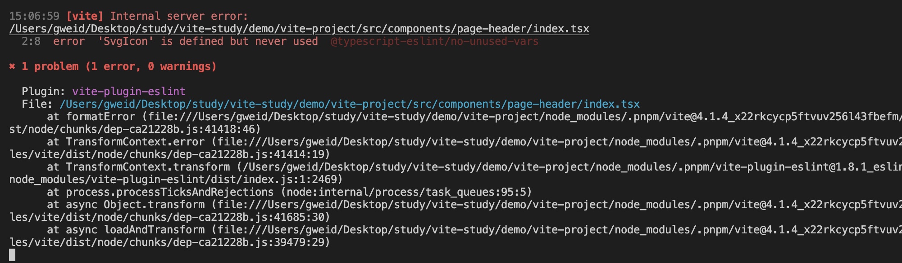
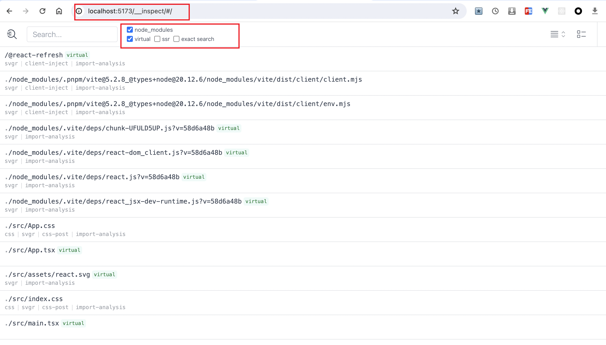

# Vite

vite 学习总结


[vite插件推荐](https://juejin.cn/post/7287131053566459963)


## 前言

前端工程的痛点：

- **前端的模块化需求**：前端的模块标准非常多，包括 ESM、CommonJS、AMD 和 CMD 等等。前端工程一方面需要落实这些模块规范，保证模块正常加载。另一方面需要兼容不同的模块规范，以适应不同的执行环境
- **浏览器兼容、转译高级语法**：由于浏览器实现规范的限制，还有不同浏览器版本语法兼容不同等原因，高级语法（ts、jsx、新es语法）等需要在浏览器运行，就得转译成浏览器可识别的形式。这个需要在工程编译层面支持
- **线上代码质量**：与开发环境不同，在生产环境中，不仅需要考虑代码的兼容性、安全性，还需要考虑代码运行时的性能问题等
- **开发效率问题**：项目的冷启动/二次启动、热更新时间，都会影响开发效率，尤其是项目越来越大的时候


而目前社区已有的，例如：webpack、rollup、parcel 等，都能解决上面的问题：

- 模块化方面，提供模块加载方案，并兼容不同的模块规范
- 语法转译方面，配合 `Sass`、`Babel` 等前端工具链，对高级语法进行转译，同时对于静态资源也能进行处理，使之能作为一个模块正常加载
- 产物质量方面，在生产环境中，配合 `Terser`等压缩工具进行代码压缩和混淆，通过 `Tree Shaking` 删除未使用的代码，提供对于低版本浏览器的语法降级处理等
- 开发效率方面，使用缓存、多线程等方式


而 Vite 的优势：兼具了以上的能力，并且做到更**高效**

- 一方面，vite 在开发阶段基于浏览器原生 ESM 的支持实现了`no-bundle`服务，
- 另一方面，构建阶段，借助 Esbuild 超快的编译速度来做第三方库构建和 TS/JSX 语法编译

基于以上两点，vite 能将项目的启动性能提升一个量级，并且达到毫秒级的瞬间热更新效果


其它方面的能力：

- 模块化方面，vite 基于浏览器原生的 ESM 支持实现模块加载，并且无论是在开发还是生产环境，都可以将其它格式的产物(如 CommonJS)转换为 ESM
- 语法转译方面，vite 内置了对 ts、jsx 等高级语法的支持，也能加载各种静态资源，例如图片等
- 产物质量方面，vite 基于 rollup 实现生产环境打包，同时可以配合`Terser`、`Babel`等工具链，可以极大程度保证构建产物的质量


## vite 的基本使用


### 项目初始化


通过命令行，快速创建 vite 项目，这里使用 pnpm 进行方式管理包

执行以下命令：

```js
pnpm create vite
```

执行完这个命令，pnpm 会先下载 `create-vite` 这个包，然后执行这个包的项目初始化逻辑，如下：


基本步骤就是：

1. 输入项目名称
2. 选择框架（react、vue 等）
3. 选择开发语言（js、ts 等）


创建完毕，进入项目，安装依赖，执行 `pnpm run dev` 即可启动项目，即可通过 `http://localhost:5173/` 进行访问：


### 项目入口加载

vite 项目的基本结构如下：

```
.
├── public
│   └── vite.svg
├── src
│   ├── assets
│   └──── react.svg
│   ├── App.css
│   ├── App.tsx
│   ├── index.css
│   ├── main.tsx
│   └── vite-env.d.ts
├── index.html
├── package.json
├── pnpm-lock.yaml
├── tsconfig.json
├── tsconfig.node.json
└── vite.config.ts
```


在项目根目录下，有 `index.html` 文件，这就是 vite 项目默认的入口文件，也就是访问 `http://localhost:5173/` 的时候，vite 的 Dev Server 会自动返回这个 HTML 文件的内容


下面来看下这个 `index.html` 里面的内容：

```html
<!DOCTYPE html>
<html lang="en">
  <head>
    <meta charset="UTF-8" />
    <link rel="icon" type="image/svg+xml" href="/vite.svg" />
    <meta name="viewport" content="width=device-width, initial-scale=1.0" />
    <title>Vite + React + TS</title>
  </head>
  <body>
    <div id="root"></div>
    <script type="module" src="/src/main.tsx"></script>
  </body>
</html>
```


这里面，比较重要的就是 

```js
<script type="module" src="/src/main.tsx"></script>
```

利用了现代浏览器原生支持 ES 模块规范的特性，只需要在 script 标签中声明 `type="module"` 即可。这样，相当于请求了 `http://localhost:5173/src/main.tsx` 这个资源，vite 的 Dev Server 此时会接受到这个请求，然后读取对应的文件内容，对内容进行一些列的处理，最后返回给浏览器


接下来，看下 `src/main.tsx` 的内容

```tsx
import React from 'react'
import ReactDOM from 'react-dom/client'
import App from './App'
import './index.css'

ReactDOM.createRoot(document.getElementById('root') as HTMLElement).render(
  <React.StrictMode>
    <App />
  </React.StrictMode>,
)
```

这里有几个疑问：

- 浏览器并不会识别 tsx 语法
- 浏览器也已无法直接 import css 文件

浏览器执行这段代码归功于 vite 做了一系列的处理。首先，在读取到 `main.tsx`文件的内容之后，vite 会对文件的内容进行编译，查看浏览器，可以看到返回如下代码：


Vite 会将项目的源代码编译成浏览器可以识别的代码，与此同时，一个 import 语句即代表了一个 HTTP 请求，基于请求，Vite Dev Server 会读取本地文件，返回浏览器可以解析的代码。当浏览器解析到新的 import 语句，又会发出新的请求，以此类推，直到所有的资源都加载完成


基于上述，vite 的 `no-bundle` 理念就是： **利用浏览器原生 ES 模块的支持，实现开发阶段的 Dev Server，进行模块的按需加载**，而不是**先整体打包再进行加载**。相比 Webpack 这种必须打包再加载的传统构建模式，vite 在**开发阶段省略了繁琐且耗时的打包过程**，这也是 vite 为什么快的一个重要原因。


### vite 构建

看下 vite 相关的构建命令

> package.json

```js
"scripts": {
  // 开发环境启动项目
  "dev": "vite",
  // 打生产环境包
  "build": "tsc && vite build",
  // 生产环境打包完，预览产物
  "preview": "vite preview"
}
```


这里有一个问题，就是，在执行生产环境打包的时候，为什么要先执行 `tsc` ？

`tsc` 作为 TypeScript 的官方编译命令，可以用来编译 TypeScript 代码并进行类型检查，而这里的作用主要是用来做类型检查。这可以从 `tsconfig.json` 中确定，有如下配置：

```json
{
  "compilerOptions": {
    // 1. noEmit 表示只做类型检查，而不会输出产物文件
    // 2. 与 tsc --noEmit 命令等效
    "noEmit": true
  }
}
```

虽然 vite 提供了开箱即用的 TypeScript 以及 JSX 的编译能力，但实际上底层并没有实现 TypeScript 的类型校验系统，因此需要借助 `tsc` 来完成类型校验，在打包前提早暴露出类型相关的问题，保证代码的健壮性

主要原因：

> 之所以不把类型检查作为转换过程的一部分，是因为这两项工作在本质上是不同的。转译可以在每个文件的基础上进行，与 Vite 的按需编译模式完全吻合。相比之下，类型检查需要了解整个模块图。把类型检查塞进 Vite 的转换管道，将不可避免地损害 Vite 的速度优势。
>
> Vite 的工作是尽可能快地将源模块转化为可以在浏览器中运行的形式。为此，我们建议将静态分析检查与 Vite 的转换管道分开。这一原则也适用于其他静态分析检查，例如 ESLint。
>
> - 在构建生产版本时，你可以在 Vite 的构建命令之外运行 `tsc --noEmit`。
> - 在开发时，如果你需要更多的 IDE 提示，我们建议在一个单独的进程中运行 `tsc --noEmit --watch`，或者如果你喜欢在浏览器中直接看到上报的类型错误，可以使用 [vite-plugin-checker](https://github.com/fi3ework/vite-plugin-checker)。


执行完 `pnpm build` 构建后，得到构建产物，此时可以通过 `pnpm preview` 预览一下**打包产物**的执行效果，相当于在本地起了服务，去加载 build 之后的资源

> 注意：使用 pnpm preview 之前，要先 build 构建出产物


### vite 对样式资源的处理

样式方案是前端工程化绕不开的一个话题，在最原始的开发阶段大家都是手写原生的 CSS，但原生 CSS 存在着诸多问题：

- **发体验**欠佳。比如原生 CSS 不支持选择器的嵌套（从Chrome 112 开始，原生 CSS也支持嵌套了）
- **样式污染**问题。如果出现同样的类名，很容易造成不同的样式互相覆盖和污染
- **浏览器兼容**问题。为了兼容不同的浏览器，我们需要对一些属性(如`transition`)加上不同的浏览器前缀
- 打包后的**代码体积**问题。如果不用任何的 CSS 工程化方案，所有的 CSS 代码都将打包到产物中，即使有部分样式并没有在代码中使用，导致产物体积过大


针对上述问题，社区诞生了一些方案：

- `CSS 预处理器`：主流的包括`Sass/Scss`、`Less`和`Stylus`。这些方案各自定义了一套语法，让 CSS 也能使用嵌套规则，甚至能像编程语言一样定义变量、写条件判断和循环语句，增强了样式语言的灵活性，解决原生 CSS 的**开发体验问题**
- `CSS Modules`：能将 CSS 类名处理成哈希值，这样就可以避免同名的情况下**样式污染**的问题
- CSS 后处理器`PostCSS`，用来解析和处理 CSS 代码，可以实现的功能非常丰富，比如将 `px` 转换为 `rem`、根据目标浏览器情况自动加上类似于`--moz--`、`-o-`的属性前缀等等
- `CSS in JS` 方案，主流的包括`emotion`、`styled-components`等等，顾名思义，这类方案可以实现直接在 JS 中写样式代码，基本包含`CSS 预处理器`和 `CSS Modules` 的各项优点，非常灵活，解决了开发体验和全局样式污染的问题
- CSS 原子化框架，如`Tailwind CSS`、`Windi CSS`，通过类名来指定样式，大大简化了样式写法，提高了样式开发的效率，主要解决了原生 CSS **开发体验**的问题

这几种方案没有孰优孰劣，各自解决的方案有重叠的部分，但也有一定的差异

那么，在 vite 中要怎么使用这几种方案呢？


#### CSS 预处理器

Vite 本身对 CSS 各种预处理器语言(`Sass/Scss`、`Less`和`Stylus`)做了内置支持。也就是说，即使你不经过任何的配置也可以直接使用各种 CSS 预处理器。

由于 Vite 底层会调用 CSS 预处理器的官方库进行编译，而 Vite 为了实现按需加载，并没有内置这些工具库，而是让用户根据需要安装。

这里以 less 为例

```shell
pnpm i less -D
```


如果使用了 ts，为了在引入样式时，不报错，需要在 `vite-env.d.ts` 中配置下

> 注意，这里一定要配置在 `/// <reference types="vite/client" />` 上面才生效

```typescript
declare module '*.module.less' {
  const classes: { readonly [key: string]: string }
  export default classes
}

/// <reference types="vite/client" />
```


安装完 less，直接就可以在项目中创建 .less 文件使用了

```
// index.less
.header {
  color: red;
}


// index.tsx
import styles from "./index.module.less"

const PageHeader = () => {
  return (
    <div className={styles.header}>this is header</div>
  )
}

export default PageHeader
```


下面来封装一个全局的主题色

```less
// variable.less
@theme-color: red;
```

然后应用这个变量

```less
@import url("../../assets/styles/variable.less");

.header {
  color: @theme-color;
}
```


但是这样有一个问题：每次要使用`$theme-color`属性的时候我们都需要手动引入`variable.scss`文件

vite 提供了方案解决这种问题，需要在 `vite.config.ts` 文件中进行一些配置

```ts
// vite.config.ts

// 如果类型报错，需要安装 @types/node: pnpm i @types/node -D
import path from 'path'
import { defineConfig, normalizePath } from 'vite'

// 全局 less 文件的路径
// 用 normalizePath 解决 window 下的路径问题
const variablePath = normalizePath(path.resolve('./src/assets/styles/variable.less'));

export default defineConfig({
  css: {
    preprocessorOptions: {
      less: {
        // additionalData 的内容会在每个 less 文件的开头自动注入
        additionalData: `@import "${variablePath}";`
      }
    }
  }
})
```

这样，就可以直接在文件中使用全局文件的变量，相当于之前手动引入的方式显然方便了许多


#### CSS Modules

CSS Modules 在 Vite 也是一个开箱即用的能力，Vite 会对后缀带有`.module`的样式文件自动应用 CSS Modules。

下面来使用下 css modules

首先，将刚刚的 less 文件名改为 `index.module.less`

然后引入方式改动下：

```tsx
import styles from "./index.module.less"

const PageHeader = () => {
  return (
    <div className={styles.header}>this is header</div>
  )
}
```


现在打开浏览器，可以看见标签的类名已经被处理成了哈希值的形式:


同样的，还可以在配置文件中`css.modules`选项来配置 CSS Modules 的功能，例如：

```ts
export default defineConfig({
  css: {
    modules: {
      // 一般我们可以通过 generateScopedName 属性来对生成的类名进行自定义
      // 其中，name 表示当前文件名，local 表示类名
      generateScopedName: "[name]__[local]__[hash:base64:8]"
    }
  }
})
```

此时，再看可以发现，类名已经变成了自定义形式


#### PostCSS

在 vite 中，可以通过 `postcss.config.js` 文件或者直接在 Vite 配置文件中进行 postcss 配置

比如这里，利用 postcss 解决浏览器兼容问题，首先安装一个 postcss 插件：`autoprefixer`

```shell
pnpm i autoprefixer -D
```


在 `vite.config.ts` 中配置

```ts
import autoprefixer from 'autoprefixer'

export default defineConfig({
  css: {
    postcss: {
      plugins: [
        autoprefixer({
          // 指定目标浏览器
          overrideBrowserslist: ['last 2 versions', 'not dead']
        })
      ]
    }
  }
})
```


在 `postcss.config.js` 中配置

```js
import autoprefixer from 'autoprefixer'

export default {
  plugins: [
    autoprefixer({
      // 指定目标浏览器
      overrideBrowserslist: ['last 2 versions', 'not dead']
    })
  ]
}
```


然后执行 `pnpm build`，后查看产物


这里，更加建议将 postcss 相关的配置放到 `postcss.config.js` 文件中


还有，这里跟浏览器相关的兼容配置，也建议抽离到 `.browserslistrc`文件，这样能做到 browserslist 的复用

```
// .browserslistrc

last 2 versions,not dead
```


由于有 CSS 代码的 AST (抽象语法树)解析能力，PostCSS 可以做的事情非常多，甚至能实现 CSS 预处理器语法和 CSS Modules，社区当中也有不少的 PostCSS 插件，除了`autoprefixer`插件，常见的插件还包括:

- [postcss-pxtorem](https://link.juejin.cn/?target=https%3A%2F%2Fgithub.com%2Fcuth%2Fpostcss-pxtorem)： 用来将 px 转换为 rem 单位，在适配移动端的场景下很常用。
- [postcss-preset-env](https://link.juejin.cn/?target=https%3A%2F%2Fgithub.com%2Fcsstools%2Fpostcss-preset-env): 通过它，你可以编写最新的 CSS 语法，不用担心兼容性问题。
- [cssnano](https://link.juejin.cn/?target=https%3A%2F%2Fgithub.com%2Fcssnano%2Fcssnano): 主要用来压缩 CSS 代码，跟常规的代码压缩工具不一样，它能做得更加智能，比如提取一些公共样式进行复用、缩短一些常见的属性值等等。

关于 PostCSS 插件，可以去这个站点探索更多的内容：[www.postcss.parts/](https://link.juejin.cn/?target=https%3A%2F%2Fwww.postcss.parts%2F) 


#### CSS In JS


#### CSS 原子化框架

在目前的社区当中，CSS 原子化框架主要包括`Tailwind CSS` 和 `Windi CSS`。

Windi CSS 作为前者的替换方案，实现了按需生成 CSS 类名的功能，开发环境下的 CSS 产物体积大大减少，速度上比`Tailwind CSS v2`快 20~100 倍！

当然，Tailwind CSS 在 v3 版本也引入 [JIT(即时编译)](https://link.juejin.cn/?target=https%3A%2F%2Fv2.tailwindcss.com%2Fdocs%2Fjust-in-time-mode) 的功能，解决了开发环境下 CSS 产物体积庞大的问题。


但是 `windi css` 在 2023-3月停止维护了，现在更建议使用 `UnoCSS`，UnoCSS 看作是 Windi CSS 的"精神继承者"


这里主要说明下 `UnoCSS`


首先，安装相关依赖

```shell
pnpm add -D unocss
```


然后配置 `vite.config.ts`

```typescript
import UnoCSS from 'unocss/vite'

export default {
  plugins: [
    UnoCSS()
  ]
}
```


接着在 `main.tsx` 中引入

```tsx
import 'virtual:uno.css'
```


这三步，就已经完成了 Windi CSS 的接入


接下来是使用

```tsx
const UnoCssCom = () => {
  return (
    <div className="p-20 text-center">
      <div className="font-bold text-2xl mb-2">windicss的使用</div>
    </div>
  )
}

export default UnoCssCom
```


可以看到，这说明已经生效了：


如果需要对 `unocss` 进行配置，那么在项目根目录下建 `unocss.config.ts` 文件

```typescript
import { defineConfig } from 'unocss'

export default defineConfig({
  
})
```


附录
[unocss 中文文档](https://alfred-skyblue.github.io/unocss-docs-cn/)

[unocss交互式文档](https://unocss.dev/interactive/)

可以通过交互式文档来查看 unocss 的值及对应的样式


### Vite 对静态资源的处理

静态资源处理是前端工程经常遇到的问题，在真实的工程中不仅仅包含了动态执行的代码，也不可避免地要引入各种静态资源，如`图片`、`JSON`、`Worker 文件`、`Web Assembly 文件`等等。

而静态资源本身并不是标准意义上的模块，因此对它们的处理和普通的代码是需要区别对待的。一方面我们需要解决**资源加载**的问题，对 Vite 来说就是如何将静态资源解析并加载为一个 ES 模块的问题；另一方面在**生产环境**下我们还需要考虑静态资源的部署问题、体积问题、网络性能问题，并采取相应的方案来进行优化。


#### 图片处理

在开发过程中，最常见的加载图片的场景：

1. 在 HTML 或者 JSX 中，通过 img 标签来加载图片，如:

```html
</img>
```

2. 在 CSS 中通过 background 属性加载图片，如:

```css
background: url('../../assets/b.png') norepeat;
```

3. 在 JavaScript 中，通过脚本的方式动态指定图片的`src`属性，如:

```javascript
document.getElementById('hero-img').src = '../../assets/c.png'
```


在 vite 中，其实已经内置了这个能力，只需要正常引入即可，但是如果需要通过别名前缀引入，俺么需要添加 `alias`

```typescript
// 如果类型报错，需要安装 @types/node: pnpm i @types/node -D
import path from 'path'
import { defineConfig } from 'vite'

export default defineConfig({
  resolve: {
    alias: {
      '@assets': path.join(__dirname, 'src/assets')
    }
  }
})
```

如果使用了 ts，那么需要配置 `tsconfig.json`

```json
{
  "compilerOptions": {
    "baseUrl": "./",
    "paths": {
      "@assets/*": ["src/assets/*"],
      "@components/*": ["src/components/*"],
    }
  }
}
```


那么就可以使用了

```tsx
import MusicLogo from '@assets/images/music.png'

const StaticCom = () => {
  return (
    <div className="text-center">
      <h3>静态资源</h3>
      
    </div>
  )
}

export default StaticCom
```


但是这里还有一个问题，在 ts 中引入会报错，需要配置下 `vite-env.d.ts` 文件

```ts
declare module '*.svg'
declare module '*.png'
declare module '*.jpg'
declare module '*.jpeg'
declare module '*.gif'
declare module '*.bmp'
declare module '*.tiff'
declare module '*.json'

/// <reference types="vite/client" />
```

一般建议将常用的静态资源配置上


#### SVG 组件方式加载

上面成功地在 Vite 中实现了图片的加载，上述这些加载的方式对于 svg 格式来说依然是适用的。不过，开发中通常也希望能将 svg 当做一个组件来引入，这样可以很方便地修改 svg 的各种属性，而且比 img 标签的引入方式更加优雅。

SVG 组件加载在不同的前端框架中的实现不太相同，社区中也已经了有了对应的插件支持：

- Vue2 项目中可以使用 [vite-plugin-vue2-svg](https://link.juejin.cn/?target=https%3A%2F%2Fgithub.com%2Fpakholeung37%2Fvite-plugin-vue2-svg)插件
- Vue3 项目中可以引入 [vite-svg-loader](https://link.juejin.cn/?target=https%3A%2F%2Fgithub.com%2Fjpkleemans%2Fvite-svg-loader)
- React 项目使用 [vite-plugin-svgr](https://link.juejin.cn/?target=https%3A%2F%2Fgithub.com%2Fpd4d10%2Fvite-plugin-svgr)插件

在 react 中安装

```shell
pnpm i vite-plugin-svgr -D
```

然后配置 `vite.config.ts`

```typescript
import svgr from 'vite-plugin-svgr'

export default defineConfig({
  plugins: [svgr()]
})
```

同时为了避免 ts 报错，需要配置 `tsconfig.json`

```json
{
  "compilerOptions": {
    "types": ["vite-plugin-svgr/client"],
  }
}
```


然后就可以引入使用了，引用方式为 `svg 图片路径+?react` 的形式

```tsx
import Algorand from "@assets/svgs/algorand.svg?react"

const StaticCom = () => {
  return (
    <div className="text-center">
      <Algorand className='w-40 h-40 mt-10'/>
    </div>
  )
}

export default StaticCom
```


#### JSON 加载

Vite 中已经内置了对于 JSON 文件的解析，底层使用`@rollup/pluginutils` 的 `dataToEsm` 方法将 JSON 对象转换为一个包含各种具名导出的 ES 模块。

使用方式

```typescript
import { version } from '../../../package.json'
```


#### 其它静态资源

除了上述的一些资源格式，Vite 也对下面几类格式提供了内置的支持：

- 媒体类文件，包括`mp4`、`webm`、`ogg`、`mp3`、`wav`、`flac`和`aac`
- 字体类文件。包括`woff`、`woff2`、`eot`、`ttf` 和 `otf`
- 文本类。包括`webmanifest`、`pdf`和`txt`

也就是说，在 Vite 中，可以将这些类型的文件当做一个 ES 模块来导入使用。如果项目中还存在其它格式的静态资源，也可以通过 `assetsInclude` 配置让 Vite 来支持加载:

配置 `vite.config.ts` 文件

```
export default defineConfig({
  assetsInclude: ['.gltf']
})
```


#### 特殊资源后缀

Vite 中引入静态资源时，支持在路径最后加上一些特殊的 query 后缀，包括：

- `?url`: 表示获取资源的路径，这在只想获取文件路径而不是内容的场景将会很有用
- `?raw`: 表示获取资源的字符串内容，如果你只想拿到资源的原始内容，可以使用这个后缀
- `?inline`: 表示资源强制内联，而不是打包成单独的文件


### Vite 生产环境静态资源处理

在生产环境下，静态资源面临着一些新的问题：

- 部署域名怎么配置？
- 资源打包成单文件还是作为 Base64 格式内联?
- 图片太大了怎么压缩？
- svg 请求数量太多了怎么优化？


#### 自定义部署域名

一般在我们访问线上的站点时，站点里面一些静态资源的地址都包含了相应域名的前缀，如:

```html

```

`https://test-888999.com/` 是 CDN 地址，`imgs/logo.png` 是开发阶段地址。那么怎么在生产阶段替换呢？


在 Vite 中我们可以有更加自动化的方式来实现地址的替换，只需要在配置文件中指定`base`参数即可：

首先，在项目根目录新增的两个环境变量文件`.env.development`和`.env.production`，顾名思义，即分别在开发环境和生产环境注入一些环境变量，这里为了区分不同环境我们加上了`NODE_ENV`

```typescript
// .env.development
NODE_ENV=development

// .env.production
NODE_ENV=production
```


配置 `vite.config.ts`

```typescript
const isProd = process.env.NODE_ENV === 'production'

const CDN_URL = 'https://test-888999.com'

export default defineConfig({
  base: isProd ? CDN_URL : '/',
})
```


执行 `pnpm build` 可以看到，已经被替换了


但是这样会有一些缺点，HTML 中的一些 JS、CSS 资源链接也一起加上了 CDN 地址前缀。

有时候可能项目中的某些图片需要存放到另外的存储服务

- 一种直接的方案是将完整地址写死到 src 属性中，比如将 CDN 前缀封装函数，每次引入

  ```typescript
  const getCDN = () => {
    const isProd = process.env.NODE_ENV === 'production'
    
    if (isProd) return 'https://test-888999.com'
    
    return ''
  }
  ```

- 另一种方法是通过定义环境变量的方式

  在项目根目录新增 `.env` 文件，内容如下：

  ```typescript
  // 优先级问题：
  // 开发环境优先级: .env.development > .env
  // 生产环境优先级: .env.production > .env
  
  VITE_IMG_BASE_URL=https://test-888999.com
  ```

  然后子啊 `vite-env.d.ts` 中增加类型声明

  ```typescript
  interface ImportMetaEnv {
    // 自定义的环境变量
    readonly VITE_IMG_BASE_URL: string;
  }
  
  interface ImportMeta {
    readonly env: ImportMetaEnv;
  }
  ```

  值得注意的是，如果某个环境变量要在 Vite 中通过 `import.meta.env` 访问，那么它必须以`VITE_`开头，如`VITE_IMG_BASE_URL`。接下来我们在组件中来使用这个环境变量:

  ```html
  
  ```

  当然，可以封装一下：

  ```typescript
  const getImgBaseUrl = (img: string) => {
    return new URL(`${img}`, import.meta.env.VITE_IMG_BASE_URL).href
  }
  ```

  > 这种方式有一个缺点，就是无论开发还是生产，都会被替换


#### 静态文件是单文件还是内联？

在 Vite 中，所有的静态资源都有两种构建方式，一种是打包成一个单文件，另一种是通过 base64 编码的格式内嵌到代码中。

一般来说，对于比较小的资源，适合内联到代码中，一方面对`代码体积`的影响很小，另一方面可以减少不必要的网络请求，`优化网络性能`。而对于比较大的资源，就推荐单独打包成一个文件，而不是内联了，否则可能导致上 MB 的 base64 字符串内嵌到代码中，导致代码体积瞬间庞大，页面加载性能直线下降。


Vite 中内置的优化方案是下面这样的:

- 如果静态资源体积 >= 4KB，则提取成单独的文件
- 如果静态资源体积 < 4KB，则作为 base64 格式的字符串内联

当然，这个 `4KB` 的临界值可以调整，配置 `vite.config.ts` 文件

```typescript
export default defineConfig({
  build: {
    assetsInlineLimit: 8 *1024
  }
})
```

> svg 格式的文件不受这个临时值的影响，始终会打包成单独的文件，因为它和普通格式的图片不一样，需要动态设置一些属性


#### 图片压缩

图片资源的体积往往是项目产物体积的大头，如果能尽可能精简图片的体积，那么对项目整体打包产物体积的优化将会是非常明显的。

在 JavaScript 领域有一个非常知名的图片压缩库[imagemin](https://link.juejin.cn/?target=https%3A%2F%2Fwww.npmjs.com%2Fpackage%2Fimagemin)，作为一个底层的压缩工具，前端的项目中经常基于它来进行图片压缩，比如 Webpack 中大名鼎鼎的`image-webpack-loader`。

Vite 社区当中也已经有了开箱即用的 Vite 插件——`vite-plugin-imagemin`


安装 `vite-plugin-imagemin`

```ts
pnpm i vite-plugin-imagemin -D
```


然后配置 `vite.config.ts`

```typescript
import viteImagemin from 'vite-plugin-imagemin'

export default defineConfig({
  plugins: [
    viteImagemin({
      // 无损压缩，无损压缩下图片质量不会变差
      optipng: {
        optimizationLevel: 7
      }
    })
  ]
})
```

执行 `pnpm build`，可以在控制台看到压缩效果


也可以进行有损压缩，这种会导致图片质量变差

```typescript
import viteImagemin from 'vite-plugin-imagemin'

export default defineConfig({
  plugins: [
    viteImagemin({
      // 有损压缩，图片质量会变差
      pngquant: {
        quality: [0.7, 0.8]
      }
    })
  ]
})
```


可以看到，压缩效率更高（但是要注意，过高的压缩率会导致图片质量变差）


`vite-plugin-imagemin` 其它的一些配置

```typescript
import { defineConfig,loadEnv} from 'vite'
import viteImagemin from 'vite-plugin-imagemin'

export default  ({ mode }) => defineConfig({
  plugins: [
    viteImagemin({
      gifsicle: { // gif图片压缩
        optimizationLevel: 3, // 选择1到3之间的优化级别
        interlaced: false, // 隔行扫描gif进行渐进式渲染
        // colors: 2 // 将每个输出GIF中不同颜色的数量减少到num或更少。数字必须介于2和256之间。
      },
      optipng: { // png
        optimizationLevel: 7, // 选择0到7之间的优化级别
      },
      mozjpeg: {// jpeg
        quality: 20, // 压缩质量，范围从0(最差)到100(最佳)。
      },
      pngquant: {// png
        quality: [0.8, 0.9], // Min和max是介于0(最差)到1(最佳)之间的数字，类似于JPEG。达到或超过最高质量所需的最少量的颜色。如果转换导致质量低于最低质量，图像将不会被保存。
        speed: 4, // 压缩速度，1(强力)到11(最快)
      },
      svgo: { // svg压缩
        plugins: [
          {
            name: 'removeViewBox',
          },
          {
            name: 'removeEmptyAttrs',
            active: false,
          },
        ],
      },
    }),
  ]
})
```


#### 雪碧图优化

在实际的项目中我们还会经常用到各种各样的 svg 图标，虽然 svg 文件一般体积不大，但 Vite 中对于 svg 文件会始终打包成单文件，大量的图标引入之后会导致网络请求增加，大量的 HTTP 请求会导致网络解析耗时变长，页面加载性能直接受到影响。

> HTTP2 的多路复用设计可以解决大量 HTTP 的请求导致的网络加载性能问题，因此雪碧图技术在 HTTP2 并没有明显的优化效果，这个技术更适合在传统的 HTTP 1.1 场景下使用(


比如分别引入 4 个 svg 文件

```typescript
import Svg1 from '@assets/svgs/svg-1.svg'
import Svg2 from '@assets/svgs/svg-2.svg'
import Svg3 from '@assets/svgs/svg-3.svg'
import Svg4 from '@assets/svgs/svg-4.svg'
```

Vite 中提供了`import.meta.glob`的语法糖来解决这种**批量导入**的问题，如上述的 import 语句可以写成下面这样

```typescript
const icons = import.meta.glob('@assets/svgs/svg-*.svg')
```

控制台打印下，结果：


可以看到对象的 value 都是动态 import，适合按需加载的场景。在这里我们只需要**同步加载**即可

```typescript
// eager: true 表示同步加载
const icons = import.meta.glob('@assets/svgs/svg-*.svg', { eager: true })

const iconUrls = Object.values(icons).map((mod: any) => mod.default)


const SvgPage = () => {
  return (
    <div className="text-center mt-10">
      {iconUrls.map(icon => (
        
      ))}
    </div>
  )
}

export default SvgPage
```


查看浏览器，可以发现，同时发出了 4 个请求


假设页面有多个 svg 图标，将会很多 HTTP 请求。此时可以将所有 svg 图标合并为雪碧图。

可以通过`vite-plugin-svg-icons`来实现这个方案

安装 `vite-plugin-svg-icons`

```typescript
pnpm i vite-plugin-svg-icons -D
```


配置 `vite.config.ts`

```typescript
import { createSvgIconsPlugin } from 'vite-plugin-svg-icons'

export default defineConfig({
  plugins: [
    createSvgIconsPlugin({
      iconDirs: [path.join(__dirname, 'src/assets/svgs')]
    })
  ]
})
```


在`src/main.tsx`文件中添加一行代码

```typescript
import 'virtual:svg-icons-register'
```


创建一个 `SvgIcon` 组件

```tsx
export interface IProps {
  name: string
  prefix?: string
  color?: string
  [key: string]: any
}

const SvgIcon = ({
  name,
  prefix = 'icon',
  color = '#333',
  ...props
}: IProps)  => {
  const symbolId = `#${prefix}-${name}`;

  return (
    <svg {...props} aria-hidden="true">
      <use href={symbolId} fill={color} />
    </svg>
  )
}

export default SvgIcon
```


使用

```tsx
import SvgIcon from '../svg-icon'

const icons = import.meta.glob('@assets/svgs/svg-*.svg', { eager: true })

// const iconUrls = Object.values(icons).map((mod: any) => mod.default)
const iconUrls = Object.values(icons).map((mod: any) => {
  const fileName = mod.default.split('/').pop();
  const [svgName] = fileName.split('.');
  return svgName;
})


const SvgPage = () => {
  return (
    <div className="text-center mt-10">
      {iconUrls.map(icon => (
        <SvgIcon name={icon} key={icon} className="w-20 h-20 ml-4" />
      ))}
    </div>
  )
}

export default SvgPage
```


现在回到浏览器的页面中，发现雪碧图已经生成：


雪碧图包含了所有图标的具体内容，而对于页面每个具体的图标，则通过 `use` 属性来引用雪碧图的对应内容


### 代码风格和质量

在真实的工程项目中，尤其是多人协作的场景下，代码规范就变得非常重要了，它可以用来统一团队代码风格，避免不同风格的代码混杂到一起难以阅读，有效提高**代码质量**，甚至可以将一些**语法错误**在开发阶段提前规避掉。但仅有规范本身不够，还需要**自动化的工具**(即`Lint 工具`)来保证规范的落地，把代码规范检查(包括`自动修复`)这件事情交给机器完成，开发者只需要专注应用逻辑本身。


#### JS/TS 规范：eslint

ESLint 主要通过配置文件对各种代码格式的规则(`rules`)进行配置，以指定具体的代码规范。目前开源社区也有一些成熟的规范集可供使用，著名的包括[Airbnb JavaScript 代码规范](https://link.juejin.cn/?target=https%3A%2F%2Fgithub.com%2Fairbnb%2Fjavascript)、[Standard JavaScript 规范](https://link.juejin.cn/?target=https%3A%2F%2Fgithub.com%2Fstandard%2Fstandard%2Fblob%2Fmaster%2Fdocs%2FREADME-zhcn.md)、[Google JavaScript 规范](https://link.juejin.cn/?target=https%3A%2F%2Fgoogle.github.io%2Fstyleguide%2Fjsguide.html)等等。当然，根据团队需求，也可以自己定制一套团队独有的代码规范，这在一些大型团队当中还是很常见的。


#### ESLint 安装及初始化

安装

```shell
pnpm i eslint -D
```


执行 ESLint 命令进行初始化

```shell
npx eslint --init
```


然后通过命令行选择，生成一份基础配置


#### ESLint 核心配置


**1、parser 解释器**

ESLint 底层默认使用 [Espree](https://link.juejin.cn/?target=https%3A%2F%2Fgithub.com%2Feslint%2Fespree)来进行 AST 解析，这个解析器目前基于 `Acron` 来实现，虽然说 `Acron` 目前能够解析绝大多数的 [ECMAScript 规范的语法](https://link.juejin.cn/?target=https%3A%2F%2Fgithub.com%2Facornjs%2Facorn%2Ftree%2Fmaster%2Facorn)，但还是不支持 TypeScript ，因此需要引入其他的解析器完成 TS 的解析。

社区提供了`@typescript-eslint/parser`这个解决方案，专门为了 TypeScript 的解析而诞生，将 `TS` 代码转换为 `Espree` 能够识别的格式(即 [**Estree 格式**](https://link.juejin.cn/?target=https%3A%2F%2Fgithub.com%2Festree%2Festree))，然后在 Eslint 下通过`Espree`进行格式检查， 以此兼容了 TypeScript 语法。

```js
module.exports = {
    "parser": "@typescript-eslint/parser"
}
```


**2、parserOptions 选项**

这个配置可以对上述的解析器进行能力定制，默认情况下 ESLint 支持 ES5 语法，可以通过这个配置进行更改，具体内容如下:

- ecmaVersion: 这个配置和 `Acron` 的 [ecmaVersion](https://link.juejin.cn/?target=https%3A%2F%2Fgithub.com%2Facornjs%2Facorn%2Ftree%2Fmaster%2Facorn) 是兼容的，可以配置 `ES + 数字`(如 ES6)或者`ES + 年份`(如 ES2015)，也可以直接配置为`latest`，启用最新的 ES 语法。
- sourceType: 默认为`script`，如果使用 ES Module 则应设置为`module`
- ecmaFeatures: 为一个对象，表示想使用的额外语言特性，如开启 `jsx`

```js
module.exports = {
    "parserOptions": {
        "ecmaVersion": "latest",
        "sourceType": "module"
    }
}
```


**3、rules 具体规则**

`rules` 配置即代表在 ESLint 中手动调整哪些代码规则，比如字符串使用单引号，这条规则可以像如下的方式配置：

```js
// .eslintrc.cjs
module.exports = {
  // 其它配置省略
  rules: {
    // key 为规则名，value 配置内容
    "quotes": ["error", "single"],
  }
}
```

在 rules 对象中，`key` 一般为`规则名`，`value` 为具体的配置内容，在上述的例子中我们设置为一个数组，数组第一项为规则的 `ID`，第二项为`规则的配置`。

这里主要看下规则 ID，可以设置如下值：

- `off` 或 `0`: 表示关闭规则
- `warn` 或 `1`: 表示开启规则，不过违背规则后只抛出 warning，而不会导致程序退出
- `error` 或 `2`: 表示开启规则，不过违背规则后抛出 error，程序会退出

当然，也可以直接将 `rules` 对象的 `value` 配置成 ID，如: `"no-cond-assign": "error"`


**4、plugins 插件**

ESLint 的 parser 基于`Acorn`实现，不能直接解析 TypeScript，需要指定 parser 选项为`@typescript-eslint/parser`才能兼容 TS 的解析。同理，ESLint 本身也没有内置 TypeScript 的代码规则，这个时候 ESLint 的插件系统就派上用场了。需要通过添加 ESLint 插件来增加一些特定的规则，比如添加`@typescript-eslint/eslint-plugin` 来拓展一些关于 TS 代码的规则，如下代码所示

```js
module.exports = {
    "plugins": [
        "@typescript-eslint",
        "react"
    ]
}
```


需要注意的是，添加插件只是拓展了 ESLint 本身的规则集，但 ESLint 默认并**没有开启**这些规则的校验！如果要开启或者调整这些规则，需要在 rules 中进行配置，如:

```js
module.exports = {
  // 开启一些 TS 规则
  rules: {
    '@typescript-eslint/ban-ts-comment': 'error',
    '@typescript-eslint/no-explicit-any': 'warn',
  }
}
```


**5、extends 继承配置**

extends 相当于`继承`另外一份 ESLint 配置，可以配置为一个字符串，也可以配置成一个字符串数组。主要分如下 3 种情况：

1. 从 ESLint 本身继承
2. 从类似 `eslint-config-xxx` 的 npm 包继承
3. 从 ESLint 插件继承

例如下面的：

```js
// .eslintrc.js
module.exports = {
   "extends": [
     // 第1种情况 
     "eslint:recommended",

     // 第2种情况，一般配置的时候可以省略 `eslint-config`
     "standard"

     // 第3种情况，可以省略包名中的 `eslint-plugin`
     // 格式一般为: `plugin:${pluginName}/${configName}`
     "plugin:react/recommended"
     "plugin:@typescript-eslint/recommended",
   ]
}
```

有了 extends 的配置，对于之前所说的 ESLint 插件中的繁多配置，我们就**不需要手动一一开启**了，通过 extends 字段即可自动开启插件中的推荐规则


**6、env 和 globals**

这两个配置分别表示`运行环境` 和 `全局变量`，在指定的运行环境中会预设一些全局变量，比如:

```js
module.exports = {
    "env": {
        "browser": true,
        "node": true
    }
}
```

指定上述的 `env` 配置后便会启用浏览器和 Node.js 环境，这两个环境中的一些全局变量(如 `window`、`global` 等)会同时启用。


有些全局变量是业务代码引入的第三方库所声明，这里就需要在`globals`配置中声明全局变量了。每个全局变量的配置值有 3 种情况：

1. `"writable"`或者 `true`，表示变量可重写
2. `"readonly"`或者`false`，表示变量不可重写
3. `"off"`，表示禁用该全局变量

这里使用 jquery 说明下：

```js
module.exports = {
  "globals": {
    // 不可重写
    "$": false, 
    "jQuery": false 
  }
}
```


#### 搭配 Prettier 使用

虽然 ESLint 本身具备自动格式化代码的功能(`eslint --fix`)，但术业有专攻，ESLint 的主要优势在于`代码的风格检查并给出提示`，而在代码格式化这一块 Prettier 做的更加专业，因此 ESLint 结合 Prettier 一起使用是最优解


安装 Prettier

```shell
pnpm i prettier -D
```


然后在项目根目录下创建 `.prettierrc.js` 文件，配置如下：

```js
// .prettierrc.js
module.exports = {
  printWidth: 120, //一行的字符数，如果超过会进行换行，默认为120
  tabWidth: 2, // 一个 tab 代表几个空格数，默认为 2 个
  useTabs: false, //是否使用 tab 进行缩进，默认为false，表示用空格进行缩减
  singleQuote: true, // 字符串是否使用单引号，默认为 false，使用双引号
  semi: true, // 行尾是否使用分号，默认为true
  trailingComma: "none", // 是否使用尾逗号
  bracketSpacing: true // 对象大括号直接是否有空格，默认为 true，效果：{ a: 1 }
};
```


如果需要将`Prettier`集成到现有的`ESLint`工具中，首先安装两个工具包：

```shell
pnpm i eslint-config-prettier eslint-plugin-prettier -D
```

其中`eslint-config-prettier`用来覆盖 ESLint 本身的规则配置，而`eslint-plugin-prettier`则是用于让 Prettier 来接管`eslint --fix`即修复代码的能力。


接着，在 `.eslintrc.cjs` 配置文件中接入 prettier 的相关工具链，如下：

```js
module.exports = {
    "extends": [
        // 接入 prettier 的规则
        "prettier",
        "plugin:prettier/recommended"
    ],
    "plugins": [
        "prettier" // 加入 prettier 的 eslint 插件
    ],
    "rules": {
        "prettier/prettier": "error", // 开启 prettier 自动修复的功能
    }
}
```


最后，在 `package.json` 中定义一个脚本

```json
{
  "scripts": {
    "lint": "eslint --ext .js,.jsx,.ts,.tsx --fix --quiet ./src",
  }
}
```


如果不想每次都手动执行这个命令，可以在`VSCode`中安装`ESLint`和`Prettier`这两个插件，并且在设置区中开启`Format On Save`


这样，在`Ctrl + S`保存代码的时候，Prettier 便会自动帮忙修复代码格式


#### 在 vite 开发环境使用 eslint

除了安装编辑器插件，还可以通过 Vite 插件的方式在开发阶段进行 ESLint 扫描，以命令行的方式展示出代码中的规范问题，并能够直接定位到原文件。


安装 `vite-plugin-eslint`

```shell
pnpm i vite-plugin-eslint -D
```


在  `vite.config.ts` 中接入

```typescript
import viteEslint from 'vite-plugin-eslint'

export default defineConfig({
  plugins: [
    viteEslint()
  ]
})
```

此时，已经可以将 eslint 错误显示在控制台了




> vite-plugin-eslint 这个插件采用另一个进程来运行 ESLint 的扫描工作，因此不会影响 Vite 项目的启动速度


#### 样式规范 stylelint

Stylelint 主要专注于样式代码的规范检查，内置了 **170 多个 CSS 书写规则**，支持 **CSS 预处理器**(如 Sass、Less)，提供**插件化机制**以供开发者扩展规则，已经被 Google、Github 等**大型团队**投入使用。与 ESLint 类似，在规范检查方面，Stylelint 已经做的足够专业，而在代码格式化方面，仍然需要结合 Prettier 一起来使用。


安装 stylelint 相关的 npm 包

```shell
pnpm i stylelint stylelint-prettier stylelint-config-prettier stylelint-config-recess-order stylelint-config-standard stylelint-config-standard-less -D
```


然后，在项目根目录新建 `.stylelintrc.js` 文件，配置内容如下：

```js
// .stylelintrc.js
module.exports = {
  // 注册 stylelint 的 prettier 插件
  plugins: ['stylelint-prettier'],
  // 继承一系列规则集合
  extends: [
    // standard 规则集合
    'stylelint-config-standard',
    // standard 规则集合的 less 版本
    'stylelint-config-standard-less',
    // 样式属性顺序规则
    'stylelint-config-recess-order',
    // 接入 Prettier 规则
    // 'stylelint-config-prettier',
    // 'stylelint-prettier/recommended'
  ],
  // 配置 rules
  rules: {
    // 开启 Prettier 自动格式化功能
    'prettier/prettier': true
  }
};
```


同样的，在开发阶段，也可以依赖 Stylelint 相关的 Vite 插件，实现在项目开发阶段提前暴露出样式代码的规范问题

安装

```shell
pnpm i vite-plugin-stylelint -D
```


配置 `vite.config.ts`

```typescript
import viteStyleLint from 'vite-plugin-stylelint'

export default defineConfig({
  plugins: [
    viteStyleLint()
  ]
})
```


这样，就会在控制台显示相应的错误提示


#### Husky + lint-staged 拦截 git 提交

在开发阶段提前规避掉代码格式的问题，但实际上这也只是将问题提前暴露，并不能保证规范问题能完全被解决，还是可能导致线上的代码出现不符合规范的情况。

在代码提交的时候进行卡点检查，也就是拦截 `git commit` 命令，进行代码格式检查，只有确保通过格式检查才允许正常提交代码。社区中已经有了对应的工具——`Husky`来完成这件事情


安装

```shell
pnpm i husky -D
```

这里需要注意的是，Husky `4.x` 及以下版本，可以在`package.json`中配置 husky 的钩子，例如：

```json
// package.json
{
  "husky": {
    "pre-commit": "npm run lint"
  }
}
```

但是在 Husky 7.x 版本以上，是无效的，Husky 7.x 以上版本需要：

```shell
pnpm exec husky init
```

执行完后，将会在项目根目录的`.husky`目录中看到名为`pre-commit`的文件，里面是 `git commit`前要执行的脚本

然后修改 `.husky/pre-commit` 文件，如下：

```shell
pnpm lint
pnpm lint:style
```

那么，在执行 git commit 之前，就会先执行检测脚本，拦截代码提交


但是以上会有一些问题：Husky 中每次执行`npm run lint`都对仓库中的代码进行全量检查，也就是说，即使某些文件并没有改动，也会走一次 Lint 检查，当项目代码越来越多的时候，提交的过程会越来越慢，影响开发体验。


而`lint-staged`就是用来解决上述全量扫描问题的，可以实现只对存入`暂存区`的文件进行 Lint 检查，大大提高了提交代码的效率


安装
```shell
pnpm i lint-staged -D
```

然后在 `package.json` 中添加

```json
{
  "name": "vite-project",
  "private": true,
  "version": "0.0.0",
  "scripts": {
    "dev": "vite",
    "dev:tsc": "tsc --noEmit --watch",
    "build": "tsc && vite build",
    "preview": "vite preview",
    "lint": "eslint --ext .js,.jsx,.ts,.tsx --fix --quiet ./src",
    "lint:style": "stylelint --fix \"src/**/*.{css,less}\"",
    "prepare": "husky"
  },

  "lint-staged": {
    "**/*.{js,jsx,tsx,ts}": [
      "npm run lint:script",
      "git add ."
    ],
    "**/*.{scss}": [
      "npm run lint:style",
      "git add ."
    ]
  },
}
```

在 Husky 中应用`lint-stage`，回到`.husky/pre-commit`脚本中，将原来的换成：

```shell
npx --no -- lint-staged
```


#### 提交时的 commit 信息规范

除了代码规范检查之后，Git 提交信息的规范也是不容忽视的一个环节，规范的 commit 信息能够方便团队协作和问题定位。首先我们来安装一下需要的工具库


安装

```shell
pnpm i commitlint @commitlint/cli @commitlint/config-conventional -D
```


项目根目录下接下来新建`.commitlintrc.js`：

```js
// .commitlintrc.js
module.exports = {
  extends: ["@commitlint/config-conventional"]
};
```


一般直接使用`@commitlint/config-conventional`规范集就可以了，它所规定的 commit 信息一般由两个部分: `type` 和 `subject` 组成，结构如下:

> // type 指提交的类型
> // subject 指提交的摘要信息
> <type>: <subject>


常用的 `type` 值包括如下:

- `feat`: 添加新功能。
- `fix`: 修复 Bug。
- `chore`: 一些不影响功能的更改。
- `docs`: 专指文档的修改。
- `perf`: 性能方面的优化。
- `refactor`: 代码重构。
- `test`: 添加一些测试代码等等。


接下来将`commitlint`的功能集成到 Husky 的钩子当中


## 深入 Vite


### Vite 的预构建能力

Vite 是一个 `no-bundle` 构建工具，相对于传统的构建工具，能做到在开发环境下按需编译，而不需要构建。极大提升开发体验。


这里需要注意的是，模块代码其实分为两部分，一部分是源代码，也就是业务代码，另一部分是第三方依赖的代码，即`node_modules`中的代码。所谓的`no-bundle`**只是对于源代码而言**，对于第三方依赖而言，Vite 还是选择 bundle(打包)，并且使用速度极快的打包器 Esbuild 来完成这一过程，达到秒级的依赖编译速度


#### 为什么需要预购建

> 可以参考官网的：https://cn.vitejs.dev/guide/dep-pre-bundling.html#the-why


首先，vite 是基于浏览器原生 ES 模块规范实现的 Dev Server，不论是应用代码，还是第三方依赖的代码，都需要符合 ESM 规范才能够正常运行。

但是对于第三方依赖，开发者没法控制打包规范。而且，就目前而言，还有相当多的第三方库仍然没有 ES 版本的产物，是 CommonJS 格式的代码，这种代码在 vite 中是无法直接运行的，那么就需要先转换为 ESM 格式的产物。


另外，还有一个问题：**请求瀑布流问题**，比如：`lodash-es`库本身是有 ES 版本产物的，可以在 Vite 中直接运行，但是 lodash-es 将 ES 模块构建为许多单独的文件。有超过 600 个模块，这导致在加载时会发出特别多的请求，导致页面加载的前几秒几都乎处于卡顿状态


在应用代码中调用了`debounce`方法，这个方法会依赖很多工具函数，每个`import`都会触发一次新的文件请求，因此在这种`依赖层级深`、`涉及模块数量多`的情况下，会触发成百上千个网络请求，巨大的请求量加上 Chrome 对同一个域名下只能同时支持 `6` 个 HTTP 并发请求的限制，导致页面加载十分缓慢。

而在进行了依赖与构建之后，`lodash-es`这个库的代码被打包成了一个文件，这样请求的数量会骤然减少，页面加载也快了许多。


总结依赖预购建做了两件事：

- 一是将其他格式(如 UMD 和 CommonJS)的产物转换为 ESM 格式，使其在浏览器通过 `<script type="module"><script>`的方式正常加载
- 二是打包第三方库的代码，将各个第三方库分散的文件合并到一起，减少 HTTP 请求数量，避免页面加载性能劣化

而这两件事，全部由性能优异的 `Esbuild` (基于 Golang 开发)完成，而不是传统的 Webpack/Rollup，所以也不会有明显的打包性能问题，反而是 Vite 项目启动飞快(秒级启动)的一个核心原因。

> Vite 1.x 使用了 Rollup 来进行依赖预构建，在 2.x 版本将 Rollup 换成了 Esbuild，编译速度提升了[近 100 倍](https://link.juejin.cn/?target=https%3A%2F%2Fesbuild.github.io%2F)！


#### 如何开启 vite 的预购建

Vite 会自动开启预购建，当第一次启动项目时，可以在命令窗口看到：


同时，在项目预构建成功后，在 `node_modules` 目录下有 `.vite` 目录，这就是预构建的产物


对于预构建的产物，Vite 的 Dev Server 会设置强缓存:


这个过期时间被设置为 1 年，一旦被缓存，这些请求将永远不会再次访问开发服务器。

会基于以下几个来源来决定是否需要重新运行预构建步骤：

- 包管理器的锁文件内容，例如 `package-lock.json`，`yarn.lock`，`pnpm-lock.yaml`，或者 `bun.lockb`；
- 补丁文件夹的修改时间；
- `vite.config.js` 中的相关字段；
- `NODE_ENV` 的值。

只有在上述其中一项发生更改时，才需要重新运行预构建。

如果出于某些原因你想要强制 Vite 重新构建依赖项，你可以在启动开发服务器时指定 `--force` 选项，或手动删除 `node_modules/.vite` 缓存目录。


#### 自定义预构建配置

Vite 可以通过提供的配置项来定制预构建的过程。Vite 将预构建相关的配置项都集中在`optimizeDeps`属性上。


##### 入口文件---entries

第一个参数是`optimizeDeps.entries`，通过这个参数可以自定义预构建的入口文件

在项目第一次启动上，vite 会默认抓取项目中所有的 HTML 文件（如当前脚手架项目中的`index.html`），将 HTML 文件作为应用入口，然后根据入口文件扫描出项目中用到的第三方依赖，最后对这些依赖逐个进行编译。

那么，当默认扫描 HTML 文件的行为无法满足需求的时候，可以通过配置指定

```tsx
// vite.config.ts
{
  optimizeDeps: {
    // 为一个字符串数组
    entries: ["./src/App.tsx"];
  }
}
```


同时，entries 配置也支持 [glob 语法](https://link.juejin.cn/?target=https%3A%2F%2Fgithub.com%2Fmrmlnc%2Ffast-glob)，如：

```tsx
entries: ["**/*.tsx"];
```


##### 添加和排除依赖---include、exclude

首先是 include，它决定了可以强制预构建的依赖项，使用方式很简单

```ts
optimizeDeps: {
  // 配置为一个字符串数组，将 `lodash-es` 进行强制依赖预构建
  include: ["lodash-es"];
}
```


什么时候可以使用 include 字段呢

- 场景一：动态 import。在某些动态 import 的场景下，由于 Vite 天然按需加载的特性，经常会导致某些依赖只能在运行时被识别出来。

  ```js
  // src/locales/zh_CN.js
  import objectAssign from "object-assign";
  console.log(objectAssign);
  
  // main.tsx
  const importModule = (m) => import(`./locales/${m}.ts`);
  importModule("zh_CN");
  
  ```

  在这个例子中，动态 import 的路径只有运行时才能确定，无法在预构建阶段被扫描出来。因此，在访问项目时控制台会出现下面的日志信息:

  

  这代表Vite 运行时发现了新的依赖，随之重新进行依赖预构建，并刷新页面。这个过程也叫**二次预构建**。

  然而，二次预构建的成本也比较大。我们不仅需要把预构建的流程重新运行一遍，还得重新刷新页面，并且需要重新请求所有的模块。尤其是在大型项目中，这个过程会严重拖慢应用的加载速度！

  此时就可以利用 include 字段提前声明需要预构建的依赖

- 场景二：某些包被手动 exclude。`exclude` 是`optimizeDeps`中的另一个配置项，与`include`相对，用于将某些依赖从预构建的过程中排除。不过这个配置并不常用，也不推荐使用。如果真遇到了要在预构建中排除某个包的情况，需要注意`它所依赖的包`是否具有 ESM 格式。比如：

  ```typescript
  // vite.config.ts
  {
    optimizeDeps: {
      exclude: ["@loadable/component"];
    }
  }
  ```

  手动排除了 @loadable/component 包之后，会发现报错

  

  刚刚手动 exclude 的包`@loadable/component`本身具有 ESM 格式的产物，但它的某个依赖`hoist-non-react-statics`的产物并没有提供 ESM 格式，导致运行时加载失败。

  此时，就可以使用 include 字段强制对`hoist-non-react-statics`这个间接依赖进行预构建

  ```typescript
  // vite.config.ts
  {
    optimizeDeps: {
      include: [
        // 间接依赖的声明语法，通过`>`分开, 如`a > b`表示 a 中依赖的 b
        "@loadable/component > hoist-non-react-statics",
      ];
    }
  }
  ```

  

####  自定义 ESBuild 行为

Vite 提供了`esbuildOptions` 参数来让我们自定义 Esbuild 本身的配置，常用的场景是加入一些 Esbuild 插件

```typescript
// vite.config.ts
{
  optimizeDeps: {
    esbuildOptions: {
       plugins: [
        // 加入 Esbuild 插件
      ];
    }
  }
}
```

这个配置主要用来处理一些特殊情况。比如某个第三方包出现问题了。


由于无法保证第三方包的代码质量，在某些情况下会遇到莫名的第三方库报错。举一个常见的案例——`react-virtualized`库。这个库被许多组件库用到，但它的 ESM 格式产物有明显的问题，在 Vite 进行预构建的时候会直接抛出这个错误：


原因是这个库的 ES 产物莫名其妙多出了一行无用的代码:

```js
// WindowScroller.js 并没有导出这个模块
import { bpfrpt_proptype_WindowScroller } from "../WindowScroller.js";
```

其实并不需要这行代码，但它却导致 Esbuild 预构建的时候直接报错退出了。


这种问题怎么处理？

- 方案一：直接修改第三方库的代码。使用`patch-package` 这个库来进行第三方包源码修改
- 方案二：加入 esbuild 插件。通过 Esbuild 插件修改指定模块的内容


这里来说下方案二，还是以 `react-virtualized` 库为例

首先，定义一个 esbuild 插件

```typescript
const esbuildPatchPlugin = {
  name: "react-virtualized-patch",
  setup(build) {
    build.onLoad(
      {
        filter:
          /react-virtualized\/dist\/es\/WindowScroller\/utils\/onScroll.js$/,
      },
      async (args) => {
        const text = await fs.promises.readFile(args.path, "utf8");

        return {
          contents: text.replace(
            'import { bpfrpt_proptype_WindowScroller } from "../WindowScroller.js";',
            ""
          ),
        };
      }
    );
  },
};
```

然后，在 `vite.config.ts` 中配置 esbuild 插件

```typescript
{
  optimizeDeps: {
    esbuildOptions: {
      plugins: [esbuildPatchPlugin];
    }
  }
}
```


### Vite 的双引擎架构

Vite 底层深度使用乐两个构建引擎——`Esbuild`和`Rollup`。下面来看下`Esbuild`和`Rollup`究竟在 Vite 中做了些什么。


#### Vite 架构图

Vite 的双引擎架构，并不是简单的：开发阶段使用 Esbuild，生产环境用 Rollup。下图就完整展示了 vite 的架构


#### ESBuild 在 Vite 中的使用


##### 1、依赖预构建（作为Bundle）工具


首先是**开发阶段的依赖预构建**阶段。上面已经分析过，`node_modules` 中的依赖如果直接在 vite 中使用，会有：ESM 格式的兼容性问题和海量请求的问题。所以对于第三方依赖，在应用启动前要进行**打包**并且**转换为 ESM 格式**。

Vite 1.x 版本中使用 Rollup 来做这件事情。但是相对于 ESBuild，性能相差实在太大了。如图：


可以看出，效率是上百倍的差别。当然，ESBuild 也有一些缺点：

- 不支持降级到 ES5 语法。这在低端浏览器会有问题
- 不支持 `const enum` 等语法。这意味着单独使用这些语法在 esbuild 中会直接抛错
- 不提供操作打包产物的接口，像 Rollup 中灵活处理打包产物的能力(如`renderChunk`钩子)在 Esbuild 当中完全没有
- 目前暂时不支持自定义 Code Splitting 策略。传统的 Webpack 和 Rollup 都提供了自定义拆包策略的 API，而 Esbuild 并未提供，从而降级了拆包优化的灵活性

虽然 ESBuild 有这么多局限性，但是在开发环境应用，是完全没问题的，可以极大提升性能。

而在生产环境，基于稳定性考虑，vite 采用了功能更加丰富、生态更加成熟的 Rollup 作为依赖打包工具。


##### 2、单文件编译——作为 TS 和 JSX 编译工具


在依赖预构建阶段， Esbuild 作为 Bundler 的角色存在。而在 TS(X)/JS(X) 单文件编译上面，Vite 也使用 Esbuild 进行语法转译，也就是将 Esbuild 作为 Transformer 来用。


也就是说，Esbuild 转译 TS 或者 JSX 的能力通过 Vite 插件提供，这个 Vite 插件在开发环境和生产环境都会执行，因此，可以得出下面这个结论：

> Vite 已经将 Esbuild 的 Transformer 能力用到了生产环境。尽管如此，对于低端浏览器场景，Vite 仍然可以做到语法和 Polyfill 安全（这个后面再分析，其实就是转换用 esbuild，语法降级使用 babel）


这部分能力用来替换原先 Babel 或者 TSC 的功能，因为无论是 Babel 还是 TSC都有性能问题。下面是一张对比图：


可以看到，Esbuild Transfomer 能带来巨大的性能提升。

但其自身也有局限性：**TS 中的类型检查问题**。这是因为 Esbuild 并没有实现 TS 的类型系统，在编译 `TS`(或者 `TSX`) 文件时仅仅抹掉了类型相关的代码，暂时没有能力实现类型检查。

因此，在执行 build 构建的时候，会先执行 tsc，如图：


##### 3、代码压缩---作为压缩工具

> Vite 从 2.6 版本开始，就官宣默认使用 Esbuild 来进行生产环境的代码压缩，包括 JS 代码和 CSS 代码。


从架构图中可以看到，在生产环境中 Esbuild 压缩器通过插件的形式融入到了 Rollup 的打包流程中

传统的方式都是使用 Terser 这种 JS 开发的压缩器来实现，在 Webpack 或者 Rollup 中作为一个 Plugin 来完成代码打包后的压缩混淆的工作。但 Terser 其实很慢，主要有 2 个原因。

1. 压缩这项工作涉及大量 AST 操作，并且在传统的构建流程中，AST 在各个工具之间无法共享，比如 Terser 就无法与 Babel 共享同一个 AST，造成了很多重复解析的过程
2. JS 本身属于解释性 + JIT（即时编译） 的语言，对于压缩这种 CPU 密集型的工作，其性能远远比不上 Golang 这种原生语言

因此，Esbuild 这种从头到尾**共享 AST** 以及**原生语言编写**的 Minifier 在性能上能够甩开传统工具的好几十倍。


可以看下面这个实际大型库(`echarts`)的压缩性能[测试项目](https://link.juejin.cn/?target=https%3A%2F%2Fgithub.com%2Fprivatenumber%2Fminification-benchmarks):


压缩一个大小为`3.2 MB`的库，Terser 需要耗费`8798 ms`，而 Esbuild 仅仅需要`361 ms`，压缩效率较 Terser 提升了二三十倍，并且产物的体积几乎没有劣化，因此 Vite 果断将其内置为默认的压缩方案。


#### 构建基石---Rollup

Rollup 是 Vite 用作生产环境打包的核心工具，也直接决定了 Vite 插件机制的设计。


##### 生产环境 Bundle

虽然 ESM 已经得到众多浏览器的原生支持，但生产环境做到完全`no-bundle`也不行，会有网络性能问题。为了在生产环境中也能取得优秀的产物性能，Vite 默认选择在生产环境中利用 `Rollup` 打包，并基于 Rollup 本身成熟的打包能力进行扩展和优化。主要包含 3 方面：

1. CSS 代码分割。如果某个异步模块中引入了一些 CSS 代码，Vite 就会自动将这些 CSS 抽取出来生成单独的文件，提高线上产物的`缓存复用率`。

2. 自动预加载。Vite 会自动为入口 chunk 的依赖自动生成预加载标签`<link rel="modulepreload">` ，如：

   ```html
   <head>
     <!-- 省略其它内容 -->
     <!-- 入口 chunk -->
     <script type="module" crossorigin src="/assets/index.250e0340.js"></script>
     <!--  自动预加载入口 chunk 所依赖的 chunk-->
     <link rel="modulepreload" href="/assets/vendor.293dca09.js">
   </head>
   
   ```

   这种适当预加载的做法会让浏览器提前下载好资源，优化页面性能

3. 异步 Chunk 加载优化。在异步引入的 Chunk 中，通常会有一些公用的模块，如现有两个异步引入的 Chunk: `A` 和 `B`，而且两者有一个公共依赖 C，如下图：

   

   一般情况下，Rollup 打包之后，会先请求 A，然后浏览器在加载 A 的过程中才决定请求和加载 C，但 Vite 进行优化之后，请求 A 的同时会自动预加载 C，通过优化 Rollup 产物依赖加载方式节省了不必要的网络开销


##### 兼容插件机制

无论是开发阶段还是生产环境，Vite 都根植于 Rollup 的插件机制和生态，如下：


在开发阶段，Vite 借鉴了 [WMR](https://link.juejin.cn/?target=https%3A%2F%2Fgithub.com%2Fpreactjs%2Fwmr) 的思路，自己实现了一个 `Plugin Container`，用来模拟 Rollup 调度各个 Vite 插件的执行逻辑，而 Vite 的插件写法完全兼容 Rollup，因此在生产环境中将所有的 Vite 插件传入 Rollup 也没有问题

反过来说，Rollup 插件却不一定能完全兼容 Vite(这部分我们会在**插件开发**小节展开来说)。不过，目前仍然有不少 Rollup 插件可以直接复用到 Vite 中，你可以通过这个站点查看所有兼容 Vite 的 Rollup 插件: [vite-rollup-plugins.patak.dev/](https://link.juejin.cn/?target=https%3A%2F%2Fvite-rollup-plugins.patak.dev%2F) 


### ESBuild 功能使用及插件开发


#### 为什么 ESBuild 性能好

Esbuild 是由 Figma 的 CTO 「Evan Wallace」基于 Golang 开发的一款打包工具，相比传统的打包工具，主打性能优势，在构建速度上可以比传统工具快 `10~100` 倍。主要原因是：

1. **使用 Golang 开发**。构建逻辑代码直接被编译为原生机器码，而不用像 JS 一样先代码解析为字节码，然后转换为机器码，大大节省了程序运行时间。
2. **多核并行**。内部打包算法充分利用多核 CPU 优势，所有的步骤尽可能并行，这也是得益于 Go 当中多线程共享内存的优势。
3. **从零造轮子**。 几乎没有使用任何第三方库，所有逻辑自己编写，大到 AST 解析，小到字符串的操作，保证极致的代码性能。
4. **高效的内存利用**。Esbuild 中从头到尾尽可能地复用一份 AST 节点数据，而不用像 JS 打包工具中频繁地解析和传递 AST 数据（如 string -> TS -> JS -> string)，造成内存的大量浪费。


#### 命令式调用

比如：

```json
 "scripts": {
    "build": "./node_modules/.bin/esbuild src/index.jsx --bundle --outfile=dist/out.js"
 },
```

此时，直接执行 `pnpm run build` 即可

但命令行的使用方式不够灵活，只能传入一些简单的命令行参数，稍微复杂的场景就不适用了，所以一般情况下我们还是会用代码调用的方式


#### 代码式调用

Esbuild 对外暴露了一系列的 API，主要包括两类: `Build API`和`Transform API`，我们可以在 Nodejs 代码中通过调用这些 API 来使用 Esbuild 的各种功能。


##### Build API --- 项目打包

`Build API`主要用来进行项目打包，包括`build`、`buildSync` 等方法

首先，创建 build.js 文件，内容如下：

```js
const { build } = require('esbuild')

async function runBuild() {
  const result = await build({
        // 当前项目根目录
        absWorkingDir: process.cwd(),
        // 入口文件列表，为一个数组
        entryPoints: ["./src/index.jsx"],
        // 打包产物目录
        outdir: "dist",
        // 是否需要打包，一般设为 true
        bundle: true,
        // 模块格式，包括`esm`、`commonjs`和`iife`
        format: "esm",
        // 是否开启自动拆包
        splitting: true,
        // 是否生成 SourceMap 文件
        sourcemap: true,
        // 是否生成打包的元信息文件
        metafile: true,
        // 是否进行代码压缩
        minify: false,
        // 是否将产物写入磁盘
        write: true,
        // Esbuild 内置了一系列的 loader，包括 base64、binary、css、dataurl、file、js(x)、ts(x)、text、json
        // 针对一些特殊的文件，调用不同的 loader 进行加载
        loader: {
          '.png': 'base64',
        }
  })

  console.log(result)
}

runBuild()
```

然后，执行 `node build.js,`可以在控制台发现如下日志信息


以上就是 Esbuild 打包的元信息，这对编写插件扩展 Esbuild 能力非常有用


接着，再观察下 dist 目录，发现打包产物和相应的 SourceMap 文件也已经成功写入磁盘


其实`buildSync`方法的使用几乎相同，但并不推荐使用 `buildSync` 这种同步的 API，它们会导致两方面不良后果。一方面容易使 Esbuild 在当前线程阻塞，丧失`并发任务处理`的优势。另一方面，Esbuild 所有插件中都不能使用任何异步操作，这给`插件开发`增加了限制。


##### Transform API --- 文件转译

除了项目的打包功能之后，Esbuild 还专门提供了单文件编译的能力，即`Transform API`，与 `Build API` 类似，它也包含了同步和异步的两个方法，分别是`transformSync`和`transform`。


在项目根目录下新建 `transform.js`

```js
const { transform } = require('esbuild')

async function runTransform() {
  const result = await transform(
    "const getFullName = (firstName: string, lastName: string): string => firstName + lastName",
    {
      sourcemap: false,
      loader: 'ts'
    }
  )

  console.log(result)
}

runTransform()
```

执行 `node transform.js` ，控制台输出信息：


#### ESBuild 插件开发

在使用 Esbuild 的时候难免会遇到一些需要加上自定义插件的场景，并且 Vite 依赖预编译的实现中大量应用了 Esbuild 插件的逻辑，插件开发是 Esbuild 中非常重要的内容。


##### ESBuild 插件的基本概念

插件开发其实就是基于原有的体系结构中进行`扩展`和`自定义`。通过 Esbuild 插件可以扩展 Esbuild 原有的路径解析、模块加载等方面的能力，并在 Esbuild 的构建过程中执行一系列自定义的逻辑


`Esbuild` 插件结构被设计为一个对象，里面有`name`和`setup`两个属性，`name`是插件的名称，`setup`是一个函数，其中入参是一个 `build` 对象，这个对象上挂载了一些钩子可自定义一些逻辑。以下是一个简单的`ESBuild`插件结构：

```js
const myPlugin = {
  name: 'my-plugin',
  setup(build) {
    build.onResolve({ filter: /^env$/ }, args => ({

    }))

    build.onLoad({ filter: /.*/, namespace: 'env-ns' }, () => ({

    }))
  },
}
```


##### 钩子函数


###### onResolve 钩子和 onLoad 钩子

在 Esbuild 插件中，`onResolve` 和 `onload`分别控制路径解析和模块内容加载的过程

下面看一段代码

```js
// build 对象在上文的 setup 钩子已经引入，这里不再重复引入

build.onResolve({ filter: /^env$/ }, args => ({
  path: args.path,
  namespace: 'env-ns',
}));


build.onLoad({ filter: /.*/, namespace: 'env-ns' }, () => ({
  contents: JSON.stringify(process.env),
  loader: 'json',
}));
```

这两个钩子，都有两个参数：`Options` 和 `Callback`。


先看 `Options` ，包含`filter`和`namespace`两个属性，

- filter：必传，是一个正则表达式，决定了要过滤出的特征文件
- namespace：选填，一般在 `onResolve` 钩子中的回调参数返回`namespace`属性作为标识，可以在`onLoad`钩子中通过 `namespace` 将模块过滤出来


回调参数 `Callback`，它的类型根据不同的钩子会有所不同。相比于 Options，Callback 函数入参和返回值的结构复杂得多，涉及很多属性：

下面是 `onResolve` 的参数及返回值

```js
build.onResolve({ filter: /^env$/ }, (args: onResolveArgs): onResolveResult => {

}

args 参数
   - path        // 模块路径
   - importer    // 父模块路径
   - namespace   //  namespace 标识
   - resolveDir  // 基准路径
   - kind        // 导入方式，如 import、require
   - pluginData  // 额外绑定的插件数据


返回值
   - errors: [] // 错误信息
   - external: false // 是否需要 external
   - namespace: 'env-ns' // namespace 标识
   - path: args.path // 模块路径
   - pluginData: null // 额外绑定的插件数据
   - pluginName: 'xxx' // 插件名称
   - sideEffects: false // 设置为 false，如果模块没有被用到，模块代码将会在产物中会删除。否则不会这么做
   - suffix: '?xxx' // 添加一些路径后缀，如`?xxx`
   - warnings: [] // 警告信息
   - watchDirs: [] // 仅仅在 Esbuild 开启 watch 模式下生效
   - watchFiles: [] // 告诉 Esbuild 需要额外监听哪些文件/目录的变化
```

下面是 `onLoad` 的参数及返回值

```js
build.onLoad({ filter: /.*/, namespace: 'env-ns' }, (args: OnLoadArgs): OnLoadResult => {

}

args 参数
   - path        // 模块路径
   - namespace   //  namespace 标识
   - suffix      // 后缀信息
   - pluginData  // 额外绑定的插件数据


返回值
   - contents: '省略内容' // 模块具体内容
   - errors: [] // 错误信息
   - loader: 'json' // 指定 loader，如`js`、`ts`、`jsx`、`tsx`、`json`等等
   - pluginData: null // 额外绑定的插件数据
   - pluginName: 'xxx' // 插件名称
   - resolveDir: './dir' // 基准路径
   - warnings: [] // 警告信息
   - watchDirs: [] // 仅仅在 Esbuild 开启 watch 模式下生效
   - watchFiles: [] // 告诉 Esbuild 需要额外监听哪些文件/目录的变化
```


###### 其它钩子

在 build 对象中，除了`onResolve`和`onLoad`，还有`onStart`和`onEnd`两个钩子用来在构建开启和结束时执行一些自定义的逻辑

```js
const myPlugin = {
  name: 'my-plugin',
  setup(build) {
    build.onStart(() => {
      console.log('build started')
    });
    build.onEnd((buildResult) => {
      if (buildResult.errors.length) {
        return;
      }
      // 构建元信息
      // 获取元信息后做一些自定义的事情，比如生成 HTML
      console.log(buildResult.metafile)
    })
  },
}
```

使用这些钩子，有两点需要注意：

- onStart 的执行时机是在每次 build 的时候，包括触发 `watch` 或者 `serve`模式下的重新构建。
- onEnd 钩子中如果要拿到 `metafile`，必须将 Esbuild 的构建配置中`metafile`属性设为 `true`。


#### esbuild 自定义 HTML 构建插件

Esbuild 作为一个前端打包工具，本身并不具备 HTML 的构建能力。也就是说，当它把 js/css 产物打包出来的时候，并不意味着前端的项目可以直接运行了，还需要一份对应的入口 HTML 文件。这份 HTML 文件当然可以手写一个，但手写显得比较麻烦，尤其是产物名称带哈希值的时候，每次打包完都要替换路径。此时就可以通过 esbuild 插件完成


> Utils.js 工具

```js

const createScript = (src) => `<script type="module" src="${src}"></script>`;

const createLink = (src) => `<link rel="stylesheet" href="${src}"></link>`;

const generateHTML = (scripts, links) => `
<!DOCTYPE html>
<html lang="en">

<head>
  <meta charset="UTF-8" />
  <meta name="viewport" content="width=device-width, initial-scale=1.0" />
  <title>Esbuild App</title>
  ${links.join("\n")}
</head>

<body>
  <div id="root"></div>
  ${scripts.join("\n")}
</body>

</html>
`;

module.exports = { createLink, createScript, generateHTML };
```


> Esbuild-html-plugin 插件

```js
const fs = require('fs/promises');
const path = require('path');
const { createScript, createLink, generateHTML } = require('./utils');

module.exports = () => {
  return {
    name: "esbuild:html",
    setup(build) {
      build.onEnd(async (res) => {
        if (res.errors.length) {
          return
        }

        const { metafile } = res

        const scripts = []
        const links = []

        if (metafile) {
          const { outputs } = metafile
          const assets = Object.keys(outputs)

          // 找到相关的静态资源
          assets.forEach((asset) => {
            if (asset.endsWith('.js')) {
              scripts.push(createScript(asset))
            } else if (asset.endsWith('.css')) {
              links.push(createLink(asset))
            }
          })

          // 拼接 html
          const templateContent = generateHTML(scripts, links);
          // HTML 写入磁盘
          const templatePath = path.join(process.cwd(), "index.html");
          await fs.writeFile(templatePath, templateContent);
        }
      })
    },
  };
}
```


使用

```js
const { build } = require('esbuild')
const EsbuildHtmlPlugin = require('./plugins/html-plugin')

async function runBuild() {
  const result = await build({
        plugins: [EsbuildHtmlPlugin()]
  })

  console.log(result)
}

runBuild()
```


### vite 的构建基石 Rollup

简化下 rollup 的构建步骤，主要是：输入  ---> 构建 ---> 输出


下面看看 Build 和 Output 两个阶段的插件工作流

#### Build 阶段插件工作流


流程解析：

1. 首先经历 `options` 钩子进行配置的转换，得到处理后的配置对象。
2. 随之 Rollup 会调用`buildStart`钩子，正式开始构建流程。
3. Rollup 先进入到 `resolveId` 钩子中解析文件路径。(从 `input` 配置指定的入口文件开始)。
4. Rollup 通过调用`load`钩子加载模块内容。
5. 紧接着 Rollup 执行所有的 `transform` 钩子来对模块内容进行进行自定义的转换，比如 babel 转译。
6. 现在 Rollup 拿到最后的模块内容，进行 AST 分析，得到所有的 import 内容，调用 moduleParsed 钩子:
   - **6.1** 如果是普通的 import，则执行 `resolveId` 钩子，继续回到步骤`3`。
   - **6.2** 如果是动态 import，则执行 `resolveDynamicImport` 钩子解析路径，如果解析成功，则回到步骤`4`加载模块，否则回到步骤`3`通过 `resolveId` 解析路径。
7. 直到所有的 import 都解析完毕，Rollup 执行`buildEnd`钩子，Build 阶段结束。


在 Rollup 解析路径的时候，即执行`resolveId`或者`resolveDynamicImport`的时候，有些路径可能会被标记为`external`(翻译为`排除`)，也就是说不参加 Rollup 打包过程，这个时候就不会进行`load`、`transform`等等后续的处理了。

在流程图最上面，有`watchChange`和`closeWatcher`这两个 Hook，这里其实是对应了 rollup 的`watch`模式。当使用 `rollup --watch` 指令或者在配置文件配有`watch: true`的属性时，代表开启了 Rollup 的`watch`打包模式，这个时候 Rollup 内部会初始化一个 `watcher` 对象，当文件内容发生变化时，watcher 对象会自动触发`watchChange`钩子执行并对项目进行重新构建。在当前**打包过程结束**时，Rollup 会自动清除 watcher 对象调用`closeWacher`钩子。


#### output 阶段插件工作流


1. 执行所有插件的 `outputOptions` 钩子函数，对 `output` 配置进行转换。
2. 执行 `renderStart`，并发执行 renderStart 钩子，正式开始打包。
3. 并发执行所有插件的`banner`、`footer`、`intro`、`outro` 钩子(底层用 Promise.all 包裹所有的这四种钩子函数)，这四个钩子功能很简单，就是往打包产物的固定位置(比如头部和尾部)插入一些自定义的内容，比如协议声明内容、项目介绍等等。
4. 从入口模块开始扫描，针对动态 import 语句执行 `renderDynamicImport`钩子，来自定义动态 import 的内容。
5. 对每个即将生成的 `chunk`，执行 `augmentChunkHash`钩子，来决定是否更改 chunk 的哈希值，在 `watch` 模式下即可能会多次打包的场景下，这个钩子会比较适用。
6. 如果没有遇到 `import.meta` 语句，则进入下一步，否则:
   - **6.1** 对于 `import.meta.url` 语句调用 `resolveFileUrl` 来自定义 url 解析逻辑
   - **6.2** 对于其他`import.meta` 属性，则调用 `resolveImportMeta` 来进行自定义的解析。
7. 接着 Rollup 会生成所有 chunk 的内容，针对每个 chunk 会依次调用插件的`renderChunk`方法进行自定义操作，也就是说，在这里时候你可以直接操作打包产物了。
8. 随后会调用 `generateBundle` 钩子，这个钩子的入参里面会包含所有的打包产物信息，包括 `chunk` (打包后的代码)、`asset`(最终的静态资源文件)。可以在这里删除一些 chunk 或者 asset，最终这些内容将不会作为产物输出。
9. 前面提到了`rollup.rollup`方法会返回一个`bundle`对象，这个对象是包含`generate`和`write`两个方法，两个方法唯一的区别在于后者会将代码写入到磁盘中，同时会触发`writeBundle`钩子，传入所有的打包产物信息，包括 chunk 和 asset，和 `generateBundle`钩子非常相似。不过值得注意的是，这个钩子执行的时候，产物已经输出了，而 generateBundle 执行的时候产物还并没有输出。

10. 当上述的`bundle`的`close`方法被调用时，会触发`closeBundle`钩子，到这里 Output 阶段正式结束。

> 当打包过程中任何阶段出现错误，会触发 renderError 钩子，然后执行closeBundle钩子结束打包。


### 开发 Vite 插件

 Vite 的插件机制是基于 Rollup 来设计的，Vite **开发阶段**会模拟 Rollup 的行为，调用一系列与 Rollup 兼容的钩子，主要分为三个阶段：

- **服务器启动阶段**: `options`和`buildStart`钩子会在服务启动时被调用。
- **请求响应阶段**: 当浏览器发起请求时，Vite 内部依次调用`resolveId`、`load`和`transform`钩子。
- **服务器关闭阶段**: Vite 会依次执行`buildEnd`和`closeBundle`钩子。

除了以上钩子，其他 Rollup 插件钩子(如`moduleParsed`、`renderChunk`)均不会在 Vite **开发阶段**调用。而生产环境下，由于 Vite 直接使用 Rollup，Vite 插件中所有 Rollup 的插件钩子都会生效。


#### 独有 Hook

实际上 Vite 的插件机制也包含了自己独有的一部分，与 Rollup 的各个插件 Hook 并非完全兼容。

下面来看下 Vite 中特有的一些 Hook，这些 Hook 只会在 Vite 内部调用，而放到 Rollup 中会被直接忽略。


##### config

Vite 在读取完配置文件（即`vite.config.ts`）之后，会拿到用户导出的配置对象，然后执行 config 钩子。在这个钩子里面，可以对配置文件导出的对象进行自定义的操作

```js
module.exports = () => {
  return {
    name: 'vite-plugin-edit-config',
    config: () => ({
      alias: {
        react: require.resolve('react')
      }
    })
  }
}
```

官方推荐的姿势是在 config 钩子中返回一个配置对象，这个配置对象会和 Vite 已有的配置进行**深度的合并**。不过也可以通过钩子的入参拿到 config 对象进行自定义的修改

```js
const mutateConfigPlugin = () => ({
  name: 'mutate-config',
  // command 为 `serve`(开发环境) 或者 `build`(生产环境)
  config(config, { command }) {
    // 生产环境中修改 root 参数
    if (command === 'build') {
      config.root = __dirname;
    }
  }
})
```


##### configResolved

Vite 在解析完配置之后会调用`configResolved`钩子，这个钩子一般用来记录最终的配置信息，而不建议再修改配置，用法如下图所示:

```js
module.exports = () => {
  let config

  return {
    name: 'vite-plugin-read-config',
    configResolved(resolvedConfig) {
      config = resolvedConfig // 记录最终配置
    },
    // 在其他钩子中可以访问到配置
    transform(code, id) {
      console.log(config);
    }
  }
}
```


##### configureServer

这个钩子仅在**开发阶段**会被调用，用于扩展 Vite 的 Dev Server，一般用于增加自定义 server 中间件，如下代码所示:

```js
module.exports = () => {
  return {
    name: 'vite-plugin-configure-server',
    configureServer(server) {
      // 方式1: 在 Vite 内置中间件之前执行
      server.middlewares.use((req, res, next) => {
        // 自定义请求处理逻辑
      })

      // 方式2: 在 Vite 内置中间件之后执行 
      return () => {
        server.middlewares.use((req, res, next) => {
          // 自定义请求处理逻辑
        })
      }
    }
  }
}
```


##### transformIndexHtml

这个钩子用来灵活控制 HTML 的内容，可以拿到原始的 html 内容后进行任意的转换：

```js
// 进行 html 替换
module.exports = () => {
  return {
    name: 'vite-plugin-html-transform',
    transformIndexHtml(html) {
      return html.replace(
        /<title>(.*?)</title>/,
        `<title>换了个标题</title>`
      )
    }
  }
}


// 可以返回如下的对象结构，一般用于添加某些标签
module.exports = () => {
  return {
    name: 'vite-plugin-html-transform',
    transformIndexHtml(html) {
      return {
        html,
        // 注入标签
        tag: [
          {
            // 放到 body 末尾，可取值还有`head`|`head-prepend`|`body-prepend`，顾名思义
            injectTo: 'body',
            // 标签属性定义
            attrs: { type: 'module', src: './index.ts' },
            // 标签名
            tag: 'script',
          }
        ]
      }
    }
  }
}
```


##### handleHotUpdate

这个钩子会在 Vite 服务端处理热更新时被调用，可以在这个钩子中拿到热更新相关的上下文信息，进行热更模块的过滤，或者进行自定义的热更处理。下面是一个简单的例子:

```js
module.exports = () => {
  return {
    name: 'vite-plugin-hot-update',
    async handleHotUpdate(ctx) {
      // 需要热更的文件
      console.log(ctx.file)
      // 需要热更的模块，如一个 Vue 单文件会涉及多个模块
      console.log(ctx.modules)
      // 时间戳
      console.log(ctx.timestamp)
      // Vite Dev Server 实例
      console.log(ctx.server)
      // 读取最新的文件内容
      console.log(await read())
      // 自行处理 HMR 事件
      ctx.server.ws.send({
        type: 'custom',
        event: 'custom-update',
        data: { a: 1 }
      })
      return []
    }
  }
}


// 前端代码中加入
if (import.meta.hot) {
  import.meta.hot.on('custom-update', (data) => {
    // 执行自定义更新
    // { a: 1 }
    console.log(data)
    window.location.reload();
  })
}
```


##### 总结

以上就是 Vite 独有的五个钩子，总结一下：

- `config`: 用来进一步修改配置。
- `configResolved`: 用来记录最终的配置信息。
- `configureServer`: 用来获取 Vite Dev Server 实例，添加中间件。
- `transformIndexHtml`: 用来转换 HTML 的内容。
- `handleHotUpdate`: 用来进行热更新模块的过滤，或者进行自定义的热更新处理。


#### 插件 Hook 执行顺序

通过一份配置查看 hook 执行顺序

```typescript
export default function testHookPlugin() {
  return {
    name: 'test-hooks-plugin',
    // Vite 独有钩子
    config() {
      console.log('config');
    },
    // Vite 独有钩子
    configResolved() {
      console.log('configResolved');
    },
    // 通用钩子
    options(opts: any) {
      console.log('options');
      return opts;
    },
    // Vite 独有钩子
    configureServer() {
      console.log('configureServer');
      setTimeout(() => {
        // 手动退出进程
        process.kill(process.pid, 'SIGTERM');
      }, 3000)
    },
    // 通用钩子
    buildStart() {
      console.log('buildStart');
    },
    // 通用钩子
    buildEnd() {
      console.log('buildEnd');
    },
    // 通用钩子
    closeBundle() {
      console.log('closeBundle');
    }
  }
}
```


因此，可以梳理出 Vite 插件的执行顺序


- 服务启动阶段: `config`、`configResolved`、`options`、`configureServer`、`buildStart`
- 请求响应阶段: 如果是 `html` 文件，仅执行`transformIndexHtml`钩子；对于非 HTML 文件，则依次执行`resolveId`、`load`和`transform`钩子。
- 热更新阶段: 执行`handleHotUpdate`钩子。
- 服务关闭阶段: 依次执行`buildEnd`和`closeBundle`钩子。


#### 插件应用位置

默认情况下 Vite 插件同时被用于开发环境和生产环境，可以通过`apply`属性来决定应用场景

```typescript
{
  // 'serve' 表示仅用于开发环境，'build'表示仅用于生产环境
  apply: 'serve'
}
```

`apply`参数还可以配置成一个函数，进行更灵活的控制:

```typescript
apply(config, { command }) {
  // 只用于非 SSR 情况下的生产环境构建
  return command === 'build' && !config.build.ssr
}
```

同时，你也可以通过`enforce`属性来指定插件的执行顺序:

```typescript
{
  // 默认为`normal`，可取值还有`pre`和`post`
  enforce: 'pre'
}
```


综上，vite 插件执行顺序为：


由上图，Vite 会依次执行如下的插件：

- Alias (路径别名)相关的插件。
- ⭐️ 带有 `enforce: 'pre'` 的用户插件。
- Vite 核心插件。
- ⭐️ 没有 enforce 值的用户插件，也叫`普通插件`。
- Vite 生产环境构建用的插件。
- ⭐️ 带有 `enforce: 'post'` 的用户插件。
- Vite 后置构建插件(如压缩插件)。


#### vite 实现 svg 组件形式加载插件

在开发过程中，希望能将 svg 当做一个组件来引入，这样可以很方便地修改 svg 的各种属性，相比于`img`标签的引入方式也更加优雅。但 Vite 本身并不支持将 svg 转换为组件的代码，需要通过自定义插件来实现。


可以参考：[vite-plugin-svgr](https://github.com/pd4d10/vite-plugin-svgr/blob/main/src/index.ts) 的实现


下面就实战下，写一个 Vite 插件，实现在 React 项目能够通过组件方式来使用 svg 资源。


安装相关依赖

```shell
pnpm i resolve @svgr/core -D
```


然后，梳理下需求：用户通过传入`defaultExport`可以控制 svg 资源的默认导出

- 当 `defaultExport`为 `component`，当做组件来使用，即

  ```tsx
  import Logo from './Logo.svg'
  
  // 在组件中直接使用
  <Logo />
  ```

- 当`defaultExports`为`url`，默认当做 url 使用，如果需要用作组件，可以通过`具名导入`的方式来支持

  ```tsx
  import logoUrl, { ReactComponent as Logo } from './logo.svg';
  
  // url 使用
  
  // 组件方式使用
  <Logo />
  ```


根据需求，整理插件思路，主要逻辑在 `transform`钩子中完成

1. 根据 id 入参过滤出 svg 资源
2. 读取 svg 文件内容
3. 利用 `@svgr/core` 将 svg 转换为 React 组件代码
4. 处理默认导出为 url 的情况
5. 将组件的 jsx 代码转译为浏览器可运行的代码


实现代码：

```typescript
import * as fs from 'fs'
import { Plugin, transformWithEsbuild } from 'vite'

interface IOptions {
  exportType?: 'url' | 'component'
}

const viteSvgrPlugin = (options: IOptions = {}): Plugin => {
  const { exportType = 'component' } = options

  return {
    name: 'vite-plugin-svgr',
    async transform(code, id) {
      // 1、根据 id 入参过滤出 svg 资源
      if (!id.endsWith('.svg')) return code

      const { transform: transformSvg } = await import('@svgr/core')
      const { default: jsx } = await import('@svgr/plugin-jsx')

      // 2、读取 svg 文件内容
      const svg = await fs.promises.readFile(id, 'utf8')

      // 3、使用 `@svgr/core` 将 svg 转换为 React 组件代码
      const svgResult = await transformSvg(
        svg,
        {},
        { caller: 
          { 
            defaultPlugins: [jsx]
          }
        }
      )

      // 4、处理默认导出为 url 的情况
      let componentCode = svgResult

      // 4.1、加上 Vite 默认的 `export default 资源路径`
      if (exportType === 'url') {
        componentCode += code
        componentCode = componentCode.replace(
          "export default ReactComponent",
          "export { ReactComponent }"
        )
      }

      // 5、利用 esbuild，将组件中的 jsx 代码转译为浏览器可运行的代码;
      const result = await transformWithEsbuild(
        componentCode,
        id,
        { loader: 'jsx' }
      )

      return {
        code: result.code,
        map: null
      }
    }
  }
}

export default viteSvgrPlugin
```

 

使用插件：

1、引用插件

```typescript
import { defineConfig } from 'vite'
import vitePluginSvgr from './plugins/vite-plugin-svgr'


// https://vitejs.dev/config/
export default defineConfig({
  plugins: [
    vitePluginSvgr()
  ],
})
```

2、在项目中使用组件方式引用 svg

```tsx
import ReactLogo from './assets/react.svg'

function App() {
  return (
    <>
      <div><ReactLogo /></div>
      <h1>Vite + React</h1>
    </>
  )
}

export default App
```

启动项目，可以看到效果


#### 调试插件

在开发调试插件的过程，官方推荐在本地装上`vite-plugin-inspect`插件，并在 Vite 中使用它:

```typescript
import { defineConfig } from 'vite'
import inspect from 'vite-plugin-inspect'

// https://vitejs.dev/config/
export default defineConfig({
  plugins: [
    inspect()
  ]
})
```


这样启动项目，会多一个地址：


然后可以通过这个地址来查看各个模块的编译结果：



点击特定文件，可以看到这个模块经过各个插件处理后的中间结果：


### vite 的 HMR

HMR 的全称叫做`Hot Module Replacement`，即`模块热替换`或者`模块热更新`。在计算机领域当中也有一个类似的概念叫`热插拔`，比如经常使用的 USB 设备就是一个典型的代表，当插入 U 盘的时候，系统驱动会加载在新增的 U 盘内容，不会重启系统，也不会修改系统其它模块的内容。HMR 的作用其实一样，就是在页面模块更新的时候，直接把**页面中发生变化的模块替换为新的模块**，同时不会影响其它模块的正常运作。

通过 HMR 的技术我们就可以实现`局部刷新`和`状态保存。`


#### Vite 的 HMR 定义

Vite 作为一个完整的构建工具，本身实现了一套 HMR 系统，值得注意的是，这套 HMR 系统基于原生的 ESM 模块规范来实现，在文件发生改变时 Vite 会侦测到相应 ES 模块的变化，从而触发相应的 API，实现局部的更新。

Vite 的 HMR API 设计也并非空穴来风，它基于一套完整的 [ESM HMR 规范](https://link.juejin.cn/?target=https%3A%2F%2Fgithub.com%2Fwithastro%2Fesm-hmr)来实现，这个规范由同时期的 no-bundle 构建工具 Snowpack、WMR 与 Vite 一起制定，是一个比较通用的规范。


HMR API 的类型定义：

```typescript
interface ImportMeta {
  readonly hot?: {
    readonly data: any
    accept(): void
    accept(cb: (mod: any) => void): void
    accept(dep: string, cb: (mod: any) => void): void
    accept(deps: string[], cb: (mods: any[]) => void): void
    prune(cb: () => void): void
    dispose(cb: (data: any) => void): void
    decline(): void
    invalidate(): void
    on(event: string, cb: (...args: any[]) => void): void
  }
}
```

`import.meta`对象为现代浏览器原生的一个内置对象，Vite 所做的事情就是在这个对象上的 `hot` 属性中定义了一套完整的属性和方法。因此，在 Vite 当中，你就可以通过`import.meta.hot`来访问关于 HMR 的这些属性和方法，比如`import.meta.hot.accept()`。


#### 模块更新时逻辑：hot.accept

在 `import.meta.hot` 对象上有一个非常关键的方法`accept`，因为它决定了 Vite 进行热更新的边界。

accept 用来**接受模块更新**的。 一旦 Vite 接受了这个更新，当前模块就会被认为是 HMR 的边界。会有三种情况：

- 接受**自身模块**的更新
- 接受**某个子模块**的更新
- 接受**多个子模块**的更新

三种情况分别对应 accept 方法三种不同的使用方式


##### 1、接受**自身模块**的更新

当模块接受自身的更新时，则当前模块会被认为 HMR 的边界。也就是说，除了当前模块，其他的模块均未受到任何影响。


例子：有 html 文件，如下：

```html
<!doctype html>
<html lang="en">
  <head>
    <meta charset="UTF-8" />
    <link rel="icon" type="image/svg+xml" href="/vite.svg" />
    <meta name="viewport" content="width=device-width, initial-scale=1.0" />
    <title>Vite + React + TS</title>
  </head>
  <body>
    <div id="root"></div>
    <p>
      count: <span id="count">0</span>
    </p>
    <script type="module" src="/src/main.tsx"></script>
  </body>
</html>
```

这份 html 文件引入了 `/src/main.ts` 这个文件，内容如下：

```ts
import { render } from './render';
import { initState } from './state';

render();
initState();
```

文件依赖了`render.ts`和`state.ts`，前者负责渲染文本内容，而后者负责记录当前的页面状态

> render.ts

```ts
export const render = () => {
  const appEle = document.getElementById('root')!
  appEle.innerHTML = `
    <h1>vite hmr</h1>
    <p>This is vite hmr</p>
  `
}
```

> state.ts

```ts
export const initState = () => {
  let count = 0;
  setInterval(() => {
    let countEle = document.getElementById('count');
    countEle!.innerText =  ++count + '';
  }, 1000);
}
```


执行 pnpm dev 启动项目，页面效果如下：


每隔一秒钟，`count`值会加一。现在改动一下 `render.ts` 的渲染内容，比如增加一些文本:

```
export const render = () => {
  const appEle = document.getElementById('root')!
  appEle.innerHTML = `
    <h1>vite hmr</h1>
+   <p>This is vite hmr  增加测试文本</p>
  `
}
```

可以发现，页面的计数被清零了


同时，查看控制台，有如下输出：

```shell
[vite] page reload src/render.ts
```

可以看出，当 `render.ts` 模块发生变更时，Vite 发现并没有 HMR 相关的处理，然后直接刷新页面了。


现在，在 render.ts 中加上 hmr 相关代码：

```ts
export const render = () => {
  const appEle = document.getElementById('root')!
  appEle.innerHTML = `
    <h1>vite hmr</h1>
    <p>This is vite hmr 增加测试文本</p>
  `
}

+ if (import.meta.hot) {
+   import.meta.hot.accept((mod: any) => mod.render())
+ }
```


此时，再修改文字，发现页面计数器没有被清空


并且控制台输出

```shell
[vite] hmr update /src/render.ts
```


##### 2、接受依赖模块的更新

上面，`main`模块依赖`render` 模块，也就是说，`main`模块是`render`父模块，那么也可以在 `main` 模块中接受`render`模块的更新，此时 HMR 边界就是`main`模块了。


改动：

- 首先，将 render 模块的 hmr 相关代码删除

  ```ts
  - if (import.meta.hot) {
  -   import.meta.hot.accept((mod) => mod.render())
  - }
  ```

- 然后，在 main 模块增加代码

  ```ts
  import { render } from './render';
  import { initState } from './state';
  
  render();
  initState();
  
  + if(import.meta.hot) {
  +   import.meta.hot.accept('./render.ts', (newModule: any) => {
  +     newModule.render()
  +   })
  + }
  ```

同样是调用 accept 方法，与之前不同的是，第一个参数传入一个依赖的路径，也就是`render`模块的路径，这就相当于告诉 Vite: 我监听了 `render` 模块的更新，当它的内容更新的时候，请把最新的内容传给我。同样的，第二个参数中定义了模块变化后的回调函数，这里拿到了 `render` 模块最新的内容，然后执行其中的渲染逻辑，让页面展示最新的内容。


此时，改动 render 模块，同样可以进行热更新


##### 3、接受多个子模块非更新

父模块可以接受多个子模块的更新，当其中任何一个子模块更新之后，父模块会成为 HMR 边界。

上面的例子，更改 main 模块代码：

```ts
import { render } from './render';
import { initState } from './state';

render();
initState();

+ if(import.meta.hot) {
+  import.meta.hot.accept(['./render.ts', './state.ts'], (modules: any) => {
+    console.log(modules)
+  })
+ }
```

通过 accept 方法接受了`render`和`state`两个模块的更新。改动一下某一个模块的代码，观察一下回调中`modules`的打印内容，例如改动了 render 模块


可以看到 Vite 回调传来的参数`modules`其实是一个数组，和第一个参数声明的子模块数组一一对应。因此`modules`数组第二个元素是 `undefined`，表示`render`模块并没有发生变化，第一个元素为一个 Module 对象，也就是经过变动后render模块的最新内容。

因此：

```ts
import { render } from './render';
import { initState } from './state';

render();
initState();

if(import.meta.hot) {
  import.meta.hot.accept(['./render.ts', './state.ts'], (modules: any) => {
    const [renderModule, stateModule] = modules
    if (renderModule) {
      renderModule.render()
    }
    if (stateModule) {
      stateModule.render()
    }
  })
}
```


#### import.meta 其它方法

##### 1、模块销毁时逻辑：import.meta.dispose

在模块更新、旧模块需要销毁时需要做的一些事情，基本用法：

```ts
if (import.meta.hot) {
  import.meta.hot.dispose(() => {
    console.log('销毁了')
  })
}
```


##### 2、共享数据：import.meta.data

这个属性用来在不同的模块实例间共享一些数据

例如，在 main 模块:

```ts
if (import.meta.hot) {
+  // 初始化 count
+  if (!import.meta.hot.data.count) {
+    import.meta.hot.data.count = 0;
+  }
}
```

然后在 render 模块，可以通过 `import.meta.hot?.data ` 方式拿到值


##### 3、限制模块不可热更：import.meta.hot.decline

方法调用之后，相当于表示此模块不可热更新，当模块更新时会强制进行页面刷新。


##### 4、强制刷新页面：import.meta.hot.invalidate

用来强制刷新页面


### 代码分割 Code Splitting

在生产环境下，为了提高页面加载性能，构建工具一般将项目的代码打包(bundle)到一起，这样上线之后只需要请求少量的 JS 文件，大大减少 HTTP 请求。当然，Vite 也不例外，默认情况下 Vite 利用底层打包引擎 Rollup 来完成项目的模块打包。

某种意义上来说，对线上环境进行项目打包是一个必须的操作。但随着前端工程的日渐复杂，单份的打包产物体积越来越庞大，会出现一系列应用加载性能问题，而代码分割可以很好地解决它们。


涉及的一些概念名词：

- `bundle` 指的是整体的打包产物，包含 JS 和各种静态资源。
- `chunk`指的是打包后的 JS 文件，是 `bundle` 的子集。
- `vendor`是指第三方包的打包产物，是一种特殊的 chunk。


#### Code Splitting 解决的问题

在传统的单 chunk 打包模式下，当项目代码越来越庞大，最后会导致浏览器下载一个巨大的文件，从页面加载性能的角度来说，主要会导致两个问题:

- 无法做到**按需加载**，即使是当前页面不需要的代码也会进行加载。
- 线上**缓存复用率**极低，改动一行代码即可导致整个 bundle 产物缓存失效。


进行`Code Splitting`之后，可以合理将代码分块，代码的改动只会影响部分的 chunk 哈希改动，这样就可以让浏览器复用本地的强缓存，大大提升线上应用的加载性能


#### vite 默认拆包策略

Vite 中已经内置了一份拆包的策略，基于 Rollup 的`manualChunks`API 实现了`应用拆包`：

- 对于 `Initital Chunk` 而言，业务代码和第三方包代码分别打包为单独的 chunk，在上述的例子中分别对应`index.js`和`vendor.js`。需要说明的是，这是 Vite 2.9 版本之前的做法，而在 Vite 2.9 及以后的版本，默认打包策略更加简单粗暴，将所有的 js 代码全部打包到 `index.js` 中
- 对于 `Async Chunk` 而言 ，动态 import 的代码会被拆分成单独的 chunk，如上述的`Dynacmic`组件


总结：Vite 默认拆包实现了 CSS 代码分割以及业务代码、第三方库代码、动态 import 模块代码三者的分离


#### 自定义拆包

针对更细粒度的拆包，Vite 的底层打包引擎 Rollup 提供了`manualChunks`，能自定义拆包策略


`manualChunks` 主要有两种配置的形式，可以配置为一个对象或者一个函数。对象的配置，也是最简单的配置方式：

```js
// vite.config.ts
{
  build: {
    rollupOptions: {
      output: {
        // manualChunks 配置
        manualChunks: {
          // 将 React 相关库打包成单独的 chunk 中
          'react-vendor': ['react', 'react-dom'],
          // 将 Lodash 库的代码单独打包
          'lodash': ['lodash-es'],
          // 将组件库的代码打包
          'library': ['antd', '@arco-design/web-react'],
        },
      },
    }
  },
}
```


函数形式的使用：

```js
// vite.config.ts
{
  build: {
    rollupOptions: {
      output: {
        // manualChunks 配置
        manualChunks(id) {
          if (id.includes('antd') || id.includes('@arco-design/web-react')) {
            return 'library';
          }
          if (id.includes('lodash')) {
            return 'lodash';
          }
          if (id.includes('react')) {
            return 'react';
          }
        }
      },
    }
  },
}
```

Rollup 会对每一个模块调用 manualChunks 函数，在 manualChunks 的函数入参中你可以拿到`模块 id` 及`模块详情信息`，经过一定的处理后返回 `chunk 文件的名称`，这样当前 id 代表的模块便会打包到你所指定的 chunk 文件中


但是自定义拆包，在低版本 vite 中会有循环依赖问题（vite 4 以上版本已经解决）

解决循环依赖，可以使用 `vite-plugin-chunk-split` 这个插件

```js
// vite.config.ts
import { chunkSplitPlugin } from 'vite-plugin-chunk-split';

export default {
  plugins: [
     chunkSplitPlugin({
      // 指定拆包策略
      customSplitting: {
        // 1. 支持填包名。`react` 和 `react-dom` 会被打包到一个名为`render-vendor`的 chunk 里面(包括它们的依赖，如 object-assign)
        'react-vendor': ['react', 'react-dom'],
        // 2. 支持填正则表达式。src 中 components 和 utils 下的所有文件被会被打包为`component-util`的 chunk 中
        'components-util': [/src\/components/, /src\/utils/]
      }
    }) 
  ]
}
```


### 语法降级与 Polyfill

在低版本浏览器中，ES6 或者更高级的语法，没法使用，此时就需要转换成 ES5。


旧版浏览器的语法兼容问题主要分两类: 

- **语法降级问题**：某些浏览器不支持箭头函数，我们就需要将其转换为`function(){}`语法
- **Polyfill 缺失问题**。`Polyfill`本身可以翻译为`垫片`，也就是为浏览器提前注入一些 API 的实现代码，如`Object.entries`方法的实现，这样可以保证产物可以正常使用这些 API，防止报错


这两类问题本质上是通过前端的编译工具链(如`Babel`)及 JS 的基础 Polyfill 库(如`corejs`)来解决的，不会跟具体的构建工具所绑定。也就是说，对于这些本质的解决方案，在其它的构建工具(如 Webpack)能使用，在 Vite 当中也完全可以使用


#### 底层工具链

结合 `@babel/cli`、`@babel/core`、`@babel/preset-env`、`browserslistrc`、`corejs`、 `regenerator-runtime` 

安装：

```shell
pnpm i @babel/cli @babel/core @babel/preset-env corejs regenerator-runtime -D
```


使用

> .browserslistrc

```text
# 现代浏览器
last 2 versions and since 2018 and > 0.5%
# 兼容低版本 PC 浏览器
IE >= 11, > 0.5%, not dead
# 兼容低版本移动端浏览器
iOS >= 9, Android >= 4.4, last 2 versions, > 0.2%, not dead
```


> babel.config.js

```js
{
  "presets": [
    [
      "@babel/preset-env", 
      {
        // 基础库 core-js 的版本，一般指定为最新的大版本
        "corejs": 3,
        // Polyfill 注入策略，后文详细介绍
        "useBuiltIns": "usage",
      }
    ]
  ]
}
```


`useBuiltIns`，它决定了添加 Polyfill 策略，默认是 `false`，即不添加任何的 Polyfill。你可以手动将`useBuiltIns`配置为`entry`或者`usage`，接下来我们看看这两个配置究竟有什么区别。


当将 useBuiltIns 设置为 entry，要求必须在入口引入

```js
// index.js 开头加上
import 'core-js';
```

此时打包出来的


Babel 已经根据`目标浏览器`的配置为我们添加了大量的 Polyfill 代码，`index.js`文件简单的几行代码被编译成近 300 行。实际上，Babel 所做的事情就是将你的`import "core-js"`代码替换成了产物中的这些具体模块的导入代码。

但这个配置有一个问题，即无法做到按需导入，上面的产物代码其实有大部分的 Polyfill 的代码我们并没有用到


而使用 usage 可以做到按需导入


但是使用 useBuiltIns: "usage" 也有缺点

- 如果使用新特性，往往是通过基础库(如 core-js)往全局环境添加 Polyfill，如果是开发应用没有任何问题，如果是开发第三方工具库，则很可能会对**全局空间造成污染**。
- 很多工具函数的实现代码(如上面示例中的`_defineProperty`方法)，会在许多文件中重现出现，造成**文件体积冗余**。


此时可以使用 transform-runtime。安装：

```shell
pnpm i @babel/plugin-transform-runtime -D
pnpm i @babel/runtime-corejs3 -S
```


使用：

```js
{
  "plugins": [
    // 添加 transform-runtime 插件
    [
      "@babel/plugin-transform-runtime", 
      {
        "corejs": 3
      }
    ]
  ],
  "presets": [
    [
      "@babel/preset-env", 
      {
        "corejs": 3,
        // 关闭 @babel/preset-env 默认的 Polyfill 注入
        "useBuiltIns": false,
        "modules": false
      }
    ]
  ]
}
```

对比结果


`transform-runtime` 一方面能够让我们在代码中使用`非全局版本`的 Polyfill，这样就避免全局空间的污染，这也得益于 `core-js` 的 pure 版本产物特性；另一方面对于`asyncToGeneator`这类的工具函数，它也将其转换成了一段引入语句，不再将完整的实现放到文件中，节省了编译后文件的体积。


#### vite 的语法降级与 Polyfill

Vite 官方已经封装好了一个开箱即用的方案: `@vitejs/plugin-legacy`，可以基于它来解决项目语法的浏览器兼容问题。这个插件内部同样使用 `@babel/preset-env` 以及 `core-js`等一系列基础库来进行语法降级和 Polyfill 注入


安装

```shell
pnpm i @vitejs/plugin-legacy -D
```


使用：

```js
// vite.config.ts
import legacy from '@vitejs/plugin-legacy';
import { defineConfig } from 'vite'

export default defineConfig({
  plugins: [
    // 省略其它插件
    legacy({
      // 设置目标浏览器，browserslist 配置语法
      targets: ['ie >= 11'],
    })
  ]
})
```


执行 npm build，可以看到 dist/assets 下多出了`index-legacy.js`、`vendor-legacy.js`以及`polyfills-legacy.js`三份产物文件


而此时的 index.html 中：

```html
<!DOCTYPE html>
<html lang="en">
  <head>
    <meta charset="UTF-8" />
    <link rel="icon" type="image/svg+xml" href="/assets/favicon.17e50649.svg" />
    <meta name="viewport" content="width=device-width, initial-scale=1.0" />
    <title>Vite App</title>
    <!-- 1. Modern 模式产物 -->
    <script type="module" crossorigin src="/assets/index.c1383506.js"></script>
    <link rel="modulepreload" href="/assets/vendor.0f99bfcc.js">
    <link rel="stylesheet" href="/assets/index.91183920.css">
  </head>
  <body>
    <div id="root"></div>
    <!-- 2. Legacy 模式产物 -->
    <script nomodule>兼容 iOS nomodule 特性的 polyfill，省略具体代码</script>
    <script nomodule id="vite-legacy-polyfill" src="/assets/polyfills-legacy.36fe2f9e.js"></script>
    <script nomodule id="vite-legacy-entry" data-src="/assets/index-legacy.c3d3f501.js">System.import(document.getElementById('vite-legacy-entry').getAttribute('data-src'))</script>
  </body>
</html>
```

通过官方的`legacy`插件， Vite 会分别打包出`Modern`模式和`Legacy`模式的产物，然后将两种产物插入同一个 HTML 里面，`Modern`产物被放到 `type="module"`的 script 标签中，而`Legacy`产物则被放到带有 [nomodule](https://link.juejin.cn/?target=https%3A%2F%2Fdeveloper.mozilla.org%2Fen-US%2Fdocs%2FWeb%2FHTML%2FElement%2Fscript%23attr-nomodule) 的 script 标签中。**这样产物便就能够同时放到现代浏览器和不支持`type="module"`的低版本浏览器当中执行**


#### legacy 插件基本原理


- 首先是在`configResolved`钩子中调整了`output`属性，这么做的目的是让 Vite 底层使用的打包引擎 Rollup 能另外打包出一份`Legacy 模式`的产物

- 接着，在`renderChunk`阶段，插件会对 Legacy 模式产物进行语法转译和 Polyfill 收集，值得注意的是，这里并不会真正注入`Polyfill`，而仅仅只是收集`Polyfill`

- 接下来会进入`generateChunk`钩子阶段，现在 Vite 会对之前收集到的`Polyfill`进行统一的打包。通过 `vite build` 对`renderChunk`中收集到 polyfill 代码进行打包，生成一个单独的 chunk

  

  > 需要注意的是，polyfill chunk 中除了包含一些 core-js 和 regenerator-runtime 的相关代码，也包含了 `SystemJS` 的实现代码，可以将其理解为 ESM 的加载器，实现了在旧版浏览器下的模块加载能力

- 经过上面，已经能够拿到 Legacy 模式的产物文件名及 Polyfill Chunk 的文件名，那么就可以通过`transformIndexHtml`钩子来将这些产物插入到 HTML 的结构中

  ```js
  {
    transformIndexHtml(html) {
      // 1. 插入 Polyfill chunk 对应的 <script nomodule> 标签
      // 2. 插入 Legacy 产物入口文件对应的 <script nomodule> 标签
    }
  }
  ```


### 模块联邦


#### 模块联邦的概念

模块联邦中主要有两种模块: `本地模块`和`远程模块`。

本地模块即为普通模块，是当前构建流程中的一部分，而远程模块不属于当前构建流程，在本地模块的运行时进行导入，同时本地模块和远程模块可以共享某些依赖的代码，如下图所示：


有意思的是：在模块联邦中，每个模块既可以是`本地模块`，导入其它的`远程模块`，又可以作为远程模块，被其他的模块导入


#### 模块联邦的优势

- **实现任意粒度的模块共享**：这里所指的模块粒度可大可小，包括第三方 npm 依赖、业务组件、工具函数，甚至可以是整个前端应用！而整个前端应用能够共享产物，代表着各个应用单独开发、测试、部署，这也是一种`微前端`的实现。

- **优化构建产物体积**：远程模块可以从本地模块运行时被拉取，而不用参与本地模块的构建，可以加速构建过程，同时也能减小构建产物。

- **运行时按需加载**：远程模块导入的粒度可以很小，如果只想使用 app1 模块的`add`函数，只需要在 app1 的构建配置中导出这个函数，然后在本地模块中按照诸如`import('app1/add')`的方式导入即可，这样就很好地实现了模块按需加载。

- **第三方依赖共享**：通过模块联邦中的共享依赖机制，可以很方便地实现在模块间公用依赖代码，从而避免以往的`external + CDN 引入`方案的各种问题。


#### vite 启用模块联邦

社区中已经提供了一个比较成熟的 Vite 模块联邦方案: `vite-plugin-federation`，这个方案基于 Vite(或者 Rollup) 实现了完整的模块联邦能力


安装：

```shell
pnpm i @originjs/vite-plugin-federation -D
```


分别创建两个项目：host（本地模块）和 remote（远程模块），配置 vite.config.js

> host ---> vite.config.js

```js
import { defineConfig } from 'vite'
import vue from '@vitejs/plugin-vue'
import federation from '@originjs/vite-plugin-federation'

export default defineConfig({
  plugins: [
    vue(),
    federation({
      // 远程模块声明
      remotes: {
        remote_app: 'http://localhost:3001/assets/remoteEntry.js'
      },
      // 共享依赖声明
      shared: ['vue'],
    }),
  ],
  build: {
    target: 'esnext',
  }
})
```


> remote ---> vite.config.js

```js
import { defineConfig } from 'vite'
import vue from '@vitejs/plugin-vue'
import federation from '@originjs/vite-plugin-federation'

// https://vite.dev/config/
export default defineConfig({
  plugins: [
    vue(),
    // 共享依赖声明
    federation({
      name: 'remote_app',
      filename: 'remoteEntry.js',
      // 导出模块声明
      exposes: {
        './Button': './src/components/Button.js',
        './App': './src/App.vue',
        './utils': './src/utils.ts',
      },
      // 共享依赖声明
      shared: ['vue'],
    }),
  ],
  build: {
    target: 'esnext',
  }
})
```


这样，基本就完成了远程模块的导出及远程模块在本地模块的注册


对远程模块 remote 做构建

```shell
// 打包产物
pnpm run build


// 模拟部署效果，一般会在生产环境将产物上传到 CDN 
npx vite preview --port=3001 --strictPort
```


然后，在本地模块中使用

```vue
<script setup lang="ts">
import HelloWorld from "./components/HelloWorld.vue";
import { defineAsyncComponent } from "vue";
// 导入远程模块
// 1. 组件
import RemoteApp from "remote_app/App";
// 2. 工具函数
import { add } from "remote_app/utils";
// 3. 异步组件
const AysncRemoteButton = defineAsyncComponent(
  () => import("remote_app/Button")
);
const data: number = add(1, 2);
</script>

<template>
  <div>
    
    <HelloWorld />
    <RemoteApp />
    <AysncRemoteButton />
    <p>应用 2 工具函数计算结果: 1 + 2 = {{ data }}</p>
  </div>
</template>

<style>
#app {
  font-family: Avenir, Helvetica, Arial, sans-serif;
  -webkit-font-smoothing: antialiased;
  -moz-osx-font-smoothing: grayscale;
  text-align: center;
  color: #2c3e50;
  margin-top: 60px;
}
</style>
```


#### vite 模块联邦原理

vite-plugin-federation 这个插件背后的原理。实现模块联邦有三大主要的要素：

- `Host`模块: 即本地模块，用来消费远程模块。

- `Remote`模块: 即远程模块，用来生产一些模块，并暴露`运行时容器`供本地模块消费。

- `Shared`依赖: 即共享依赖，用来在本地模块和远程模块中实现第三方依赖的共享。


在使用远程模块中：

```js
import RemoteApp from "remote_app/App";
```

这段代码被编译成：

```js
// 远程模块表
const remotesMap = {
  'remote_app':{url:'http://localhost:3001/assets/remoteEntry.js',format:'esm',from:'vite'},
  'shared':{url:'vue',format:'esm',from:'vite'}
};

async function ensure() {
  const remote = remoteMap[remoteId];
  // 做一些初始化逻辑，暂时忽略
  // 返回的是运行时容器
}

async function getRemote(remoteName, componentName) {
  return ensure(remoteName)
    // 从运行时容器里面获取远程模块
    .then(remote => remote.get(componentName))
    .then(factory => factory());
}

// import 语句被编译成了这样
// tip: es2020 产物语法已经支持顶层 await
const __remote_appApp = await getRemote("remote_app" , "./App");
```

除了 import 语句被编译之外，在代码中还添加了`remoteMap`和一些工具函数，它们的目的很简单，就是通过访问远端的**运行时容器**来拉取对应名称的模块


运行时容器其实就是指远程模块打包产物`remoteEntry.js`的导出对象，看看它的逻辑：

```js
// remoteEntry.js
const moduleMap = {
  "./Button": () => {
    return import('./__federation_expose_Button.js').then(module => () => module)
  },
  "./App": () => {
    dynamicLoadingCss('./__federation_expose_App.css');
    return import('./__federation_expose_App.js').then(module => () => module);
  },
  './utils': () => {
    return import('./__federation_expose_Utils.js').then(module => () => module);
  }
};

// 加载 css
const dynamicLoadingCss = (cssFilePath) => {
  const metaUrl = import.meta.url;
  if (typeof metaUrl == 'undefined') {
    console.warn('The remote style takes effect only when the build.target option in the vite.config.ts file is higher than that of "es2020".');
    return
  }
  const curUrl = metaUrl.substring(0, metaUrl.lastIndexOf('remoteEntry.js'));
  const element = document.head.appendChild(document.createElement('link'));
  element.href = curUrl + cssFilePath;
  element.rel = 'stylesheet';
};

// 关键方法，暴露模块
const get =(module) => {
  return moduleMap[module]();
};

const init = () => {
  // 初始化逻辑，用于共享模块，暂时省略
}

export { dynamicLoadingCss, get, init }
```

- `moduleMap`用来记录导出模块的信息，所有在`exposes`参数中声明的模块都会打包成单独的文件，然后通过 `dynamic import` 进行导入。

- 容器导出了十分关键的`get`方法，让本地模块能够通过调用这个方法来访问到该远程模块。


继续分析共享依赖的实现。本地模块设置了`shared: ['vue']`参数之后，当它执行远程模块代码的时候，一旦遇到了引入`vue`的情况，会优先使用本地的 `vue`，而不是远端模块中的`vue`


本地模块编译后的`ensure`函数逻辑

```js
// host

// 下面是共享依赖表。每个共享依赖都会单独打包
const shareScope = {
  'vue':{'3.2.31':{get:()=>get('./__federation_shared_vue.js'), loaded:1}}
};
async function ensure(remoteId) {
  const remote = remotesMap[remoteId];
  if (remote.inited) {
    return new Promise(resolve => {
        if (!remote.inited) {
          remote.lib = window[remoteId];
          remote.lib.init(shareScope);
          remote.inited = true;
        }
        resolve(remote.lib);
    });
  }
}
```

`ensure`函数的主要逻辑是将共享依赖信息传递给远程模块的运行时容器，并进行容器的初始化


接下来进入容器初始化的逻辑`init`中：

```js
const init =(shareScope) => {
  globalThis.__federation_shared__= globalThis.__federation_shared__|| {};

  // 下面的逻辑作用很简单，就是将本地模块的`共享模块表`绑定到远程模块的全局 window 对象上
  Object.entries(shareScope).forEach(([key, value]) => {
    const versionKey = Object.keys(value)[0];
    const versionValue = Object.values(value)[0];
    const scope = versionValue.scope || 'default';
    globalThis.__federation_shared__[scope] = globalThis.__federation_shared__[scope] || {};
    const shared= globalThis.__federation_shared__[scope];
    (shared[key] = shared[key]||{})[versionKey] = versionValue;
  });
};
```

这样，当本地模块的`共享依赖表`能够在远程模块访问时，远程模块内也就能够使用本地模块的依赖(如 `vue`)了

共享依赖的基本流程如下：


### 性能优化

对于项目的加载性能优化而言，常见的优化手段可以分为下面三类:

1. **网络优化**：包括 `HTTP2`、`DNS 预解析`、`Preload`、`Prefetch`等手段
2. **资源优化**：包括`构建产物分析`、`资源压缩`、`产物拆包`、`按需加载`等优化方式
3. **预渲染优化**：`服务端渲染`(SSR)和`静态站点生成`(SSG) 等


#### 网络优化


##### HTTP2

在 Vite 中，我们可以通过`vite-plugin-mkcert`在本地 Dev Server 上开启 HTTP2:

```shell
pnpm i vite-plugin-mkcert -D
```


使用：

```js
// vite.config.ts
import { defineConfig } from "vite";
import react from "@vitejs/plugin-react";
import mkcert from "vite-plugin-mkcert";

export default defineConfig({
  plugins: [react(), mkcert()],
  server: {
    // https 选项需要开启
    https: true,
  },
});
```


插件的原理也比较简单，由于 HTTP2 依赖 TLS 握手，插件会帮你自动生成 TLS 证书，然后支持通过 HTTPS 的方式启动，而 Vite 会自动把 HTTPS 服务升级为 HTTP2

> 需要注意的是，当使用 Vite 的 proxy 配置时，Vite 会将 HTTP2 降级为 HTTPS，不过这个问题可以通过 [vite-plugin-proxy-middleware](https://link.juejin.cn/?target=https%3A%2F%2Fgithub.com%2Fwilliamyorkl%2Fvite-plugin-proxy-middleware) 插件解决。


`vite-plugin-mkcert`插件仅用于开发阶段，在生产环境中我们会对线上的服务器进行配置，从而开启 HTTP2 的能力，如 [Nginx 的 HTTP2 配置](https://link.juejin.cn/?target=http%3A%2F%2Fnginx.org%2Fen%2Fdocs%2Fhttp%2Fngx_http_v2_module.html)


##### preload/prefresh


#### 资源优化


##### 产物分析

可以使用 `rollup-plugin-visualizer`来进行产物分析


安装：

```shell
pnpm i rollup-plugin-visualizer -D
```


使用：

```js
import { defineConfig } from "vite";
import react from "@vitejs/plugin-react";
import { visualizer } from "rollup-plugin-visualizer";

// https://vitejs.dev/config/
export default defineConfig({
  plugins: [
    react(),
    visualizer({
      // 打包完成后自动打开浏览器，显示产物体积报告
      open: true,
    }),
  ],
});
```


执行`pnpm run build`之后，浏览器会自动打开产物分析页面：


##### js 压缩

配置如下：

```js
// vite.config.ts
export default {
  build: {
    // 类型: boolean | 'esbuild' | 'terser'
    // 默认为 `esbuild`
    minify: 'esbuild',
    // 产物目标环境
    target: 'modules',
    // 如果 minify 为 terser，可以通过下面的参数配置具体行为
    // https://terser.org/docs/api-reference#minify-options
    terserOptions: {}
  }
}

```

- vite 的 target 默认是 modules，对应 browserlist 

  ```js
  ['es2019', 'edge88', 'firefox78', 'chrome87', 'safari13.1']
  ```

  > 疑问：压缩代码，为什么还跟目标环境有关系呢？
  >
  > 
  >
  > 对于 JS 代码压缩的理解仅仅停留在去除空行、混淆变量名的层面是不够的，为了达到极致的压缩效果，压缩器一般会根据浏览器的目标，会对代码进行语法层面的转换
  >
  > 
  >
  > 比如
  >
  > ```js
  > // 业务代码中
  > info == null ? undefined : info.name
  > ```
  >
  > 如果将 `target` 配置为`exnext`，也就是最新的 JS 语法，会发现压缩后的代码变成了下面这样:
  >
  > ```js
  > info?.name
  > ```
  >
  > 这就是压缩工具在背后所做的事情，将某些语句识别之后转换成更高级的语法，从而达到更优的代码体积


##### css 压缩

配置如下：

```js
// vite.config.ts
export default {
  build: {
    // 设置 CSS 的目标环境
    cssTarget: ''
  }
}
```

默认情况下 Vite 会使用 Esbuild 对 CSS 代码进行压缩，一般不需要我们对 `cssTarget` 进行配置。

> 不过在需要兼容安卓端微信的 webview 时，我们需要将 `build.cssTarget` 设置为 `chrome61`，以防止 vite 将 `rgba()` 颜色转化为 `#RGBA` 十六进制符号的形式，出现样式问题。


##### 图片压缩

图片压缩使用插件 `vite-plugin-imagemin`，具体可查看 [图片压缩](#图片压缩)


##### 代码分割

具体查看 [代码分割 Code Splitting](#代码分割 Code Splitting)


## Vite 源码


